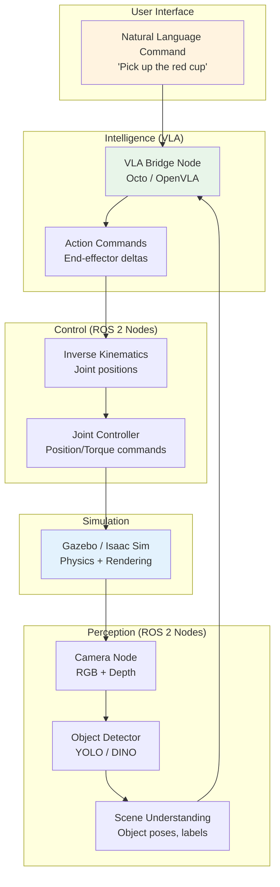
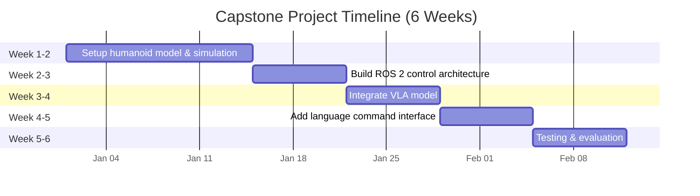

# Capstone Project: The Autonomous Humanoid

## Learning Objectives

After completing this capstone, you will be able to:

- **Integrate** ROS 2, Gazebo/Isaac Sim, and a VLA model into a single autonomous system
- **Design** a multi-node ROS 2 architecture for perception, planning, and control
- **Deploy** a VLA-powered robot that executes natural language commands in simulation
- **Evaluate** system performance with quantitative metrics (success rate, latency, robustness)
- **Debug** cross-module integration issues using ROS 2 diagnostic tools

**Estimated completion time**: 20–30 hours (4–6 weeks at 5 hrs/week)

**Prerequisites**: All four modules (ROS 2, Gazebo/Unity, Isaac, VLA)

---

## Project Overview

The capstone project brings together every module into a single system: a simulated humanoid robot that receives natural language commands ("Pick up the red cup and place it on the shelf") and executes them autonomously.

The system combines:
- **Module 1 (ROS 2)**: Communication backbone connecting all components
- **Module 2 (Gazebo/Isaac)**: Simulated environment with the humanoid and objects
- **Module 3 (Isaac Gym)**: RL-trained locomotion and manipulation skills
- **Module 4 (VLA)**: Language-conditioned action generation



*Figure: Complete capstone system architecture. Natural language flows through the VLA, which generates actions executed by the controller in simulation. Camera feedback closes the loop.*

### Project Milestones



*Figure: Suggested 6-week project timeline. Each week builds on the previous milestone.*

---

## Step-by-Step Implementation

### Step 1: Setting Up the Humanoid Robot Model

**Goal**: Load a humanoid robot in Gazebo or Isaac Sim with functional joints and sensors.

**Option A — Gazebo (no GPU required):**

Create a URDF for a simplified humanoid or use an existing model:

```bash
# Install humanoid robot packages:
sudo apt install -y ros-humble-robot-state-publisher

# Clone a humanoid URDF (e.g., Unitree H1):
cd ~/ros2_ws/src
git clone https://github.com/unitreerobotics/unitree_ros2.git
```

Create a launch file `capstone_gazebo.launch.py`:

```python
"""Launch humanoid robot in Gazebo for capstone project."""

import os
from ament_index_python.packages import get_package_share_directory
from launch import LaunchDescription
from launch.actions import IncludeLaunchDescription
from launch.launch_description_sources import PythonLaunchDescriptionSource
from launch_ros.actions import Node


def generate_launch_description():
    # Load robot description
    robot_description = open(
        os.path.expanduser('~/ros2_ws/src/unitree_ros2/urdf/h1.urdf')
    ).read()

    return LaunchDescription([
        # Start Gazebo
        IncludeLaunchDescription(
            PythonLaunchDescriptionSource(
                os.path.join(
                    get_package_share_directory('ros_gz_sim'),
                    'launch', 'gz_sim.launch.py'
                )
            ),
            launch_arguments={'gz_args': '-r empty.sdf'}.items(),
        ),

        # Publish robot description
        Node(
            package='robot_state_publisher',
            executable='robot_state_publisher',
            parameters=[{'robot_description': robot_description}],
        ),

        # Spawn robot
        Node(
            package='ros_gz_sim',
            executable='create',
            arguments=['-name', 'humanoid', '-topic', '/robot_description'],
        ),

        # Bridge sensor topics
        Node(
            package='ros_gz_bridge',
            executable='parameter_bridge',
            arguments=[
                '/camera/image_raw@sensor_msgs/msg/Image@gz.msgs.Image',
                '/joint_states@sensor_msgs/msg/JointState@gz.msgs.Model',
                '/cmd_vel@geometry_msgs/msg/Twist@gz.msgs.Twist',
                '/clock@rosgraph_msgs/msg/Clock@gz.msgs.Clock',
            ],
        ),
    ])
```

**Option B — Isaac Sim (GPU required):**

```python
"""Load humanoid in Isaac Sim."""

from omni.isaac.kit import SimulationApp
simulation_app = SimulationApp({"headless": False})

from omni.isaac.core import World
from omni.isaac.core.utils.stage import add_reference_to_stage
from omni.isaac.core.robots import Robot
import numpy as np

world = World(stage_units_in_meters=1.0)
world.scene.add_default_ground_plane()

# Load humanoid robot (Isaac Sim includes several)
add_reference_to_stage(
    usd_path="/Isaac/Robots/Humanoid/humanoid.usd",
    prim_path="/World/Humanoid"
)

robot = world.scene.add(
    Robot(prim_path="/World/Humanoid", name="humanoid")
)

world.reset()
print(f"Humanoid loaded: {robot.num_dof} DOF")
print(f"Joint names: {robot.dof_names}")
```

:::tip Start Simple
Begin with Gazebo and a simplified robot model. Move to Isaac Sim only if you need GPU-accelerated training or photorealistic rendering. The ROS 2 architecture is the same regardless of simulator.
:::

---

### Step 2: Building the ROS 2 Control Architecture

**Goal**: Create the node graph that connects perception, intelligence, and control.

Create a package for the capstone:

```bash
cd ~/ros2_ws/src
ros2 pkg create --build-type ament_python capstone_humanoid
```

Create the perception node `capstone_humanoid/perception_node.py`:

```python
"""Perception node: processes camera images and detects objects."""

import rclpy
from rclpy.node import Node
from sensor_msgs.msg import Image
from std_msgs.msg import String
from cv_bridge import CvBridge
import json


class PerceptionNode(Node):
    """Detects objects in camera images and publishes scene state."""

    def __init__(self):
        super().__init__('perception_node')
        self.bridge = CvBridge()

        self.image_sub = self.create_subscription(
            Image, '/camera/image_raw', self.image_callback, 10
        )

        # Publish detected objects as JSON
        self.scene_pub = self.create_publisher(
            String, '/scene_state', 10
        )

        self.get_logger().info('Perception node started.')

    def image_callback(self, msg):
        """Process image and detect objects."""
        cv_image = self.bridge.imgmsg_to_cv2(msg, 'rgb8')

        # Simple object detection (replace with YOLO/DINO in production)
        # For capstone, can use color-based detection as a starting point
        detected_objects = self.detect_objects(cv_image)

        scene_msg = String()
        scene_msg.data = json.dumps(detected_objects)
        self.scene_pub.publish(scene_msg)

    def detect_objects(self, image):
        """Detect objects using color thresholding (simplified)."""
        import cv2
        import numpy as np

        hsv = cv2.cvtColor(image, cv2.COLOR_RGB2HSV)

        objects = []
        # Detect red objects
        red_mask = cv2.inRange(hsv, (0, 120, 70), (10, 255, 255))
        contours, _ = cv2.findContours(
            red_mask, cv2.RETR_EXTERNAL, cv2.CHAIN_APPROX_SIMPLE
        )
        for cnt in contours:
            if cv2.contourArea(cnt) > 500:
                x, y, w, h = cv2.boundingRect(cnt)
                objects.append({
                    'class': 'red_object',
                    'bbox': [int(x), int(y), int(w), int(h)],
                    'center': [int(x + w/2), int(y + h/2)],
                })

        return {'objects': objects, 'count': len(objects)}
```

Create the controller node `capstone_humanoid/controller_node.py`:

```python
"""Controller node: converts actions to joint commands."""

import rclpy
from rclpy.node import Node
from std_msgs.msg import Float64MultiArray
from sensor_msgs.msg import JointState
import numpy as np


class ControllerNode(Node):
    """Receives VLA actions and sends joint commands to the robot."""

    def __init__(self):
        super().__init__('controller_node')

        # Subscribe to VLA actions
        self.action_sub = self.create_subscription(
            Float64MultiArray, '/robot_action', self.action_callback, 10
        )

        # Subscribe to current joint states
        self.joint_sub = self.create_subscription(
            JointState, '/joint_states', self.joint_callback, 10
        )

        # Publish joint position commands
        self.cmd_pub = self.create_publisher(
            Float64MultiArray, '/joint_commands', 10
        )

        self.current_joints = None
        self.get_logger().info('Controller node started.')

    def joint_callback(self, msg):
        """Update current joint positions."""
        self.current_joints = np.array(msg.position)

    def action_callback(self, msg):
        """Convert VLA end-effector delta to joint commands."""
        if self.current_joints is None:
            return

        action = np.array(msg.data)  # 7-DOF: [dx,dy,dz,drx,dry,drz,grip]

        # Scale actions (VLA outputs small deltas)
        ee_delta = action[:6] * 0.05  # 5cm max per step
        gripper = action[6]

        # Simplified: apply delta directly to joints
        # In production, use inverse kinematics
        joint_delta = np.zeros_like(self.current_joints)
        joint_delta[:6] = ee_delta  # Map to first 6 joints
        target_joints = self.current_joints + joint_delta

        # Publish
        cmd_msg = Float64MultiArray()
        cmd_msg.data = target_joints.tolist()
        self.cmd_pub.publish(cmd_msg)

        self.get_logger().info(
            f'Command sent. Gripper: {"close" if gripper > 0.5 else "open"}'
        )
```

Create the main launch file `capstone_humanoid/launch/full_system.launch.py`:

```python
"""Launch the complete capstone system."""

from launch import LaunchDescription
from launch_ros.actions import Node
from launch.actions import LogInfo


def generate_launch_description():
    return LaunchDescription([
        LogInfo(msg='Starting Capstone: Autonomous Humanoid System'),

        Node(
            package='capstone_humanoid',
            executable='perception_node',
            name='perception',
            output='screen',
        ),

        Node(
            package='capstone_humanoid',
            executable='controller_node',
            name='controller',
            output='screen',
        ),

        # VLA bridge node (from Module 4)
        Node(
            package='vla_bridge',
            executable='vla_node',
            name='vla_bridge',
            output='screen',
        ),
    ])
```

---

### Step 3: Training the VLA Policy

**Goal**: Fine-tune Octo or OpenVLA on humanoid manipulation tasks.

Collect demonstration data by teleoperating the humanoid in simulation:

```python
"""Collect teleoperation data for VLA fine-tuning."""

import rclpy
from rclpy.node import Node
from sensor_msgs.msg import Image, JointState
from cv_bridge import CvBridge
import numpy as np
import json
import os


class DataCollector(Node):
    """Records camera images and joint states during teleoperation."""

    def __init__(self, output_dir='~/capstone_data'):
        super().__init__('data_collector')
        self.output_dir = os.path.expanduser(output_dir)
        os.makedirs(self.output_dir, exist_ok=True)

        self.bridge = CvBridge()
        self.episode = 0
        self.step = 0
        self.recording = False
        self.episode_data = []

        self.image_sub = self.create_subscription(
            Image, '/camera/image_raw', self.image_callback, 10
        )
        self.joint_sub = self.create_subscription(
            JointState, '/joint_states', self.joint_callback, 10
        )

        self.current_image = None
        self.current_joints = None

        # Record at 2 Hz
        self.timer = self.create_timer(0.5, self.record_step)
        self.recording = True
        self.get_logger().info('Data collector ready. Recording...')

    def image_callback(self, msg):
        self.current_image = self.bridge.imgmsg_to_cv2(msg, 'rgb8')

    def joint_callback(self, msg):
        self.current_joints = list(msg.position)

    def record_step(self):
        if not self.recording or self.current_image is None:
            return

        step_data = {
            'step': self.step,
            'joints': self.current_joints,
            'image_path': f'episode_{self.episode}/step_{self.step}.png',
        }
        self.episode_data.append(step_data)
        self.step += 1

        if self.step >= 100:  # Max 100 steps per episode
            self.save_episode()

    def save_episode(self):
        ep_dir = os.path.join(self.output_dir, f'episode_{self.episode}')
        os.makedirs(ep_dir, exist_ok=True)

        with open(os.path.join(ep_dir, 'trajectory.json'), 'w') as f:
            json.dump(self.episode_data, f)

        self.get_logger().info(
            f'Episode {self.episode} saved ({self.step} steps)'
        )
        self.episode += 1
        self.step = 0
        self.episode_data = []
```

---

### Step 4: Integrating Language Commands

**Goal**: Add a natural language interface that converts user commands into VLA task specifications.

```python
"""Language command interface for the capstone system."""

import rclpy
from rclpy.node import Node
from std_msgs.msg import String


class LanguageInterface(Node):
    """Accepts natural language commands and publishes to VLA bridge."""

    def __init__(self):
        super().__init__('language_interface')

        self.cmd_pub = self.create_publisher(
            String, '/language_command', 10
        )

        # Predefined task vocabulary for the capstone
        self.tasks = {
            '1': 'Pick up the red cup',
            '2': 'Place the cup on the shelf',
            '3': 'Push the block to the right',
            '4': 'Open the drawer',
            '5': 'Wave hello',
        }

        self.timer = self.create_timer(1.0, self.prompt_user)
        self.get_logger().info('Language interface ready.')
        self.print_menu()

    def print_menu(self):
        self.get_logger().info('=== Available Commands ===')
        for key, task in self.tasks.items():
            self.get_logger().info(f'  {key}: {task}')
        self.get_logger().info('  c: Custom command')
        self.get_logger().info('  q: Quit')

    def prompt_user(self):
        """Non-blocking check for user input."""
        # In practice, use a service or action for interactive input
        pass

    def send_command(self, command: str):
        msg = String()
        msg.data = command
        self.cmd_pub.publish(msg)
        self.get_logger().info(f'Sent command: {command}')
```

:::tip Scope Management
The capstone is intentionally ambitious. If time is limited, focus on a subset:
- **Minimum viable**: ROS 2 nodes + Gazebo + simple VLA inference (no fine-tuning)
- **Standard scope**: Add data collection + basic evaluation
- **Extended scope**: Fine-tune VLA + comprehensive evaluation + comparison with classical planning
:::

---

### Step 5: Testing and Evaluation

**Goal**: Define success metrics and evaluate the complete system.

```python
"""Evaluation framework for the capstone project."""

import rclpy
from rclpy.node import Node
from std_msgs.msg import String, Float64MultiArray
import time
import json


class CapstoneEvaluator(Node):
    """Evaluates capstone system performance."""

    def __init__(self):
        super().__init__('evaluator')
        self.results = []

        # Test scenarios
        self.scenarios = [
            {'command': 'Pick up the red cup', 'target': 'red_cup'},
            {'command': 'Place the cup on the table', 'target': 'table'},
            {'command': 'Push the block left', 'target': 'block'},
        ]

    def run_evaluation(self, num_trials=10):
        """Run evaluation across all scenarios."""
        for scenario in self.scenarios:
            successes = 0
            total_time = 0

            for trial in range(num_trials):
                start_time = time.time()
                success = self.run_trial(scenario)
                elapsed = time.time() - start_time

                if success:
                    successes += 1
                total_time += elapsed

            result = {
                'command': scenario['command'],
                'success_rate': successes / num_trials * 100,
                'mean_time': total_time / num_trials,
                'trials': num_trials,
            }
            self.results.append(result)

        self.print_results()

    def run_trial(self, scenario):
        """Run a single trial. Returns True if successful."""
        # Implement: send command, wait for completion, check success
        # This depends on your specific simulation setup
        return False  # Placeholder

    def print_results(self):
        """Print evaluation summary."""
        print('\n=== Capstone Evaluation Results ===')
        print(f'{"Command":<35} {"Success %":<12} {"Mean Time":<12}')
        print('-' * 60)
        for r in self.results:
            print(
                f'{r["command"]:<35} '
                f'{r["success_rate"]:<12.1f} '
                f'{r["mean_time"]:<12.2f}s'
            )
```

---

## Troubleshooting

### Common Integration Errors

**1. Node communication failure**: Nodes cannot find each other's topics.
- Verify all nodes use the same `ROS_DOMAIN_ID`
- Check `ros2 topic list` to see active topics
- Ensure message types match between publisher and subscriber

**2. VLA inference too slow**: Actions arrive slower than the control loop.
- Use Octo-small (faster) instead of OpenVLA
- Reduce camera resolution to 256x256
- Run inference on a dedicated GPU, separate from simulation

**3. Robot falls over in simulation**: Physics instability.
- Reduce the physics timestep (`dt = 0.0005`)
- Check inertia values in URDF (unrealistic values cause instability)
- Add damping to joints

**4. Gripper does not grasp objects**: Contact physics issues.
- Increase friction coefficients in the SDF/URDF
- Verify collision geometry covers the gripper fingers
- Check gripper force limits match object weight

**5. Actions oscillate or jitter**: VLA outputs noisy actions.
- Apply exponential moving average smoothing to VLA outputs
- Reduce action magnitude scaling factor
- Increase inference frequency (more frequent, smaller actions)

---

## Grading & Assessment

**Estimated completion time**: 20–30 hours

### Grading Rubric (Suggested)

| Component | Weight | Criteria |
|-----------|--------|----------|
| **System Architecture** | 20% | Clean ROS 2 node graph, proper topic naming, launch file |
| **Simulation Setup** | 15% | Robot loads, environment has objects, sensors work |
| **VLA Integration** | 25% | VLA node runs inference, actions reach controller |
| **Task Execution** | 25% | Robot performs at least 2 manipulation tasks from language commands |
| **Evaluation** | 15% | Quantitative results reported (success rate, timing) |

### Deliverables

1. **Code repository** with all ROS 2 packages, launch files, and configurations
2. **Demo video** (2-3 minutes) showing the system executing language commands
3. **Evaluation report** (1-2 pages) with success rates, timing, and analysis
4. **Architecture diagram** showing all nodes, topics, and data flow

:::tip Presentation Tips
Record your demo video showing:
1. The simulation environment with the robot
2. You typing a natural language command
3. The robot executing the command
4. Terminal output showing node communication
:::

---

**Next**: [Resources & Further Reading](./resources) provides reference links, hardware recommendations, and a comprehensive reading list.
