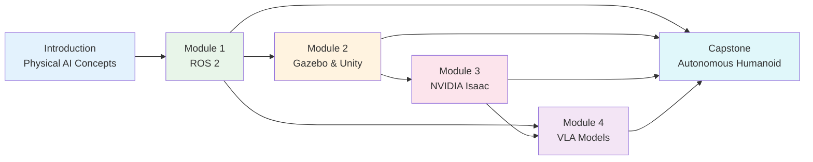

# Physical AI & Humanoid Robotics

**Bridging Digital Intelligence and Physical Embodiment**

A hands-on guide for university students ready to build intelligent robots that see, think, and act in the physical world. This book teaches you to combine ROS 2, simulation environments, NVIDIA Isaac, and Vision-Language-Action models into a complete autonomous humanoid system.

:::info Target Audience
**Final-year university students** (capstone project level) with working knowledge of Python, basic AI/ML concepts, and ROS fundamentals.
:::

---

## What You Will Build

By the end of this book, you will have built a complete **autonomous humanoid robot system** that:

- Receives natural language commands ("pick up the red cup")
- Perceives its environment through cameras and sensors
- Plans and executes physical manipulation tasks
- Runs in both simulation and (optionally) on real hardware

---

## Prerequisites

Before starting, verify you have:

- **Python 3.10+** — comfortable with classes, async, and package management
- **Basic AI/ML** — understand supervised learning, neural networks, and training loops
- **ROS fundamentals** — familiar with nodes, topics, and basic ROS concepts (ROS 1 or 2)
- **Linux basics** — comfortable with terminal, bash, and package installation
- **Git** — version control for managing your project code

---

## Course Structure

This book is organized into **four core modules** plus an **introduction** and a **capstone project**. Each module builds on the previous one.

| Module | Topic | Est. Time | Key Skills |
|--------|-------|-----------|------------|
| [Introduction](./intro) | Physical AI & Embodied Intelligence | 2-3 hrs | Concepts, motivation, landscape |
| [Module 1](./module1-ros2) | The Robotic Nervous System (ROS 2) | 6-8 hrs | Nodes, topics, services, launch files |
| [Module 2](./module2-gazebo-unity) | The Digital Twin (Gazebo & Unity) | 8-10 hrs | URDF, simulation, sensor models |
| [Module 3](./module3-isaac) | The AI-Robot Brain (NVIDIA Isaac) | 8-10 hrs | Isaac Sim, synthetic data, RL |
| [Module 4](./module4-vla) | Vision-Language-Action Models | 8-10 hrs | VLA inference, ROS 2 integration |
| [Capstone](./capstone) | The Autonomous Humanoid | 20-30 hrs | Full system integration |

**Total estimated time**: 50-70 hours (one semester at 4-5 hours/week)

---

## How to Use This Book

:::tip Self-Paced Learning
Each module is designed to be **independently completable**. While the recommended order follows the table above, you can jump to any module if you meet its prerequisites.
:::

1. **Read the theory** — understand the concepts before coding
2. **Follow the tutorials** — type the code yourself (don't just copy-paste)
3. **Run the examples** — verify your output matches the expected results
4. **Complete the exercises** — practice reinforces understanding
5. **Check troubleshooting** — when stuck, check common errors first before searching online

---

## Hardware Requirements

| Component | Minimum | Recommended |
|-----------|---------|-------------|
| CPU | Intel i5 / AMD Ryzen 5 | Intel i7 / AMD Ryzen 7 |
| RAM | 16 GB | 32 GB |
| GPU | Integrated (Modules 1-2) | NVIDIA RTX 3060+ (Modules 3-4) |
| Storage | 50 GB free | 100 GB SSD |
| OS | Ubuntu 22.04 LTS | Ubuntu 22.04 LTS |

:::warning GPU Requirements
**Modules 3 (Isaac) and 4 (VLA)** require an NVIDIA GPU. If you don't have one, each module provides **cloud-based alternatives** (Docker containers, Google Colab, NVIDIA NGC).
:::

---

## Software Stack

| Tool | Version | Used In |
|------|---------|---------|
| ROS 2 | Humble Hawksbill (LTS) | All modules |
| Python | 3.10+ | All modules |
| Gazebo | Harmonic | Module 2 |
| Unity | 2022.3 LTS + ML-Agents | Module 2 |
| NVIDIA Isaac Sim | 4.x+ | Module 3 |
| PyTorch | 2.x | Module 4 |
| HuggingFace Transformers | 4.x | Module 4 |

---

## Get Started

Ready to build intelligent robots? Start with the [Introduction](./intro) to understand what Physical AI is and why it matters.
