# Introduction: Physical AI & Embodied Intelligence

## Learning Objectives

After completing this introduction, you will be able to:

- Define **Physical AI** and explain how it differs from purely digital AI
- Describe the concept of **embodied intelligence** and its role in robotics
- Identify the key components of the **sim-to-real pipeline**
- Explain why **humanoid robotics** is experiencing rapid advancement
- Map the technology stack used throughout this book (ROS 2, Gazebo, Isaac Sim, VLA)
- Assess your own readiness using the prerequisites checklist

**Estimated completion time**: 2-3 hours

---

## What is Physical AI?

Artificial intelligence has achieved remarkable results in digital domains — language translation, image generation, game playing, and code writing. However, these systems operate entirely in the world of bits. They process text, pixels, and tokens, but they never touch, lift, or navigate anything.

**Physical AI** is the field of building AI systems that interact with the physical world through a robot body. Unlike a chatbot that produces text, a Physical AI system must:

- **Perceive** — process camera images, lidar point clouds, force/torque sensor readings, and joint position encoders from its own body and the surrounding environment
- **Reason** — decide what actions to take given its current goals and the state of the physical world, accounting for uncertainty in its own sensors and the behavior of other objects
- **Act** — send motor commands to joints, grippers, and wheels that move objects and change the state of the environment in irreversible ways

This creates fundamentally different challenges than digital AI. A language model can retry a generation in milliseconds. A robot arm that drops a glass cannot undo the result. Physical AI must handle **real-time constraints**, **noisy sensors**, **uncertain dynamics**, and **safety-critical outcomes**.

*Figure: Digital AI processes data in a single pass. Physical AI operates in a continuous perception-action loop with the real world.*

:::note Key Insight
The fundamental difference is the **feedback loop**. Physical AI systems are *closed-loop* — their actions change the environment, which changes their sensor readings, which changes their next action. This creates challenges (instability, compounding errors) but also opportunities (learning from physical interaction).
:::

---

## Embodied Intelligence: Why the Body Matters

A common assumption is that intelligence lives entirely "in the brain." Give a powerful enough neural network the right sensors, and it will figure out how to control any body. Research in **embodied cognition** challenges this view.

The physical structure of a robot — its shape, weight distribution, joint limits, and sensor placement — fundamentally shapes what it can learn and how it behaves. Consider three examples:

1. **A wheeled robot** can move efficiently on flat surfaces but cannot climb stairs, grasp objects, or operate human tools. Its body constrains its intelligence to navigation tasks.

2. **A robotic arm on a table** can manipulate objects within its workspace but cannot explore new environments or respond to being pushed. Its body enables precise manipulation but prevents locomotion.

3. **A humanoid robot** has legs for locomotion, arms for manipulation, and a head for perception — matching the form of human environments. It can (in theory) navigate human spaces and use human tools, but controlling 30+ joints simultaneously is far more complex.

The body is not just a vehicle for the brain — it is part of the intelligence. This principle drives the design choices we make throughout this book: we build systems where **perception, planning, and control are tightly integrated** with the robot's physical capabilities.

```mermaid
graph LR
    subgraph "Robot Morphology Spectrum"
        W["Wheeled<br/>🚗 Simple<br/>Navigation only"] --> A["Arm<br/>🦾 Medium<br/>Manipulation only"]
        A --> H["Humanoid<br/>🤖 Complex<br/>Navigation + Manipulation"]
    end

    style W fill:#e8f5e9
    style A fill:#fff3e0
    style H fill:#fce4ec
```

*Figure: As robot morphology increases in complexity, the range of possible tasks expands — but so does the control challenge.*

---

## Why Humanoid Robotics? Why Now?

Humanoid robots have been a research topic for decades (Honda's ASIMO debuted in 2000), but the field is accelerating dramatically. Several converging trends explain this timing:

**1. Foundation Models for Robotics**
Large language models (LLMs) and vision-language models (VLMs) provide a new way to give robots common-sense knowledge about the world. Instead of hand-coding every behavior, we can leverage models trained on internet-scale data to understand natural language commands and visual scenes.

**2. Simulation at Scale**
Modern GPU-accelerated simulators (NVIDIA Isaac Sim, MuJoCo) can run thousands of robot instances in parallel, generating years of experience in hours. This makes reinforcement learning practical for complex locomotion and manipulation.

**3. Hardware Advances**
Companies like Boston Dynamics, Tesla (Optimus), Figure AI, and Unitree are producing increasingly capable humanoid platforms at decreasing costs. University labs can now access affordable humanoid robots for research.

**4. The Sim-to-Real Gap is Closing**
Techniques like domain randomization, system identification, and sim-to-real transfer learning have dramatically improved. Policies trained entirely in simulation now transfer to real robots with high success rates.

:::tip Industry Context
As of 2025-2026, major tech companies (NVIDIA, Google DeepMind, Tesla, Figure AI, 1X Technologies) are investing billions in humanoid robotics. Understanding this technology stack positions you at the frontier of a rapidly growing field.
:::

---

## The Technology Stack

This book teaches you a complete pipeline from robot communication to AI-driven behavior. Here is how each module fits together:

*Figure: The book's technology stack. Each module builds on the previous ones, culminating in a VLA-powered robot that understands language and acts in the physical world.*

| Layer | Tool | Role |
|-------|------|------|
| **Communication** | ROS 2 Humble | Message passing between all robot components |
| **Simulation** | Gazebo / Unity | Test robot behavior without physical hardware |
| **Training Platform** | NVIDIA Isaac Sim | GPU-accelerated simulation for RL and synthetic data |
| **Intelligence** | VLA Models (Octo, OpenVLA) | Map vision + language to robot actions |

---

## The Sim-to-Real Pipeline

A central concept in this book is the **sim-to-real pipeline**: developing, testing, and training robot behaviors in simulation before deploying them on physical hardware.

*Figure: The sim-to-real pipeline. Steps 1-4 happen entirely in software. Only step 5 requires physical hardware.*

This pipeline is powerful because:

- **Safety**: Test dangerous behaviors (falling, collisions) without damaging hardware
- **Speed**: Run thousands of episodes in parallel on GPUs
- **Cost**: No wear and tear on expensive robot hardware during development
- **Reproducibility**: Reset the simulation to the exact same state for consistent experiments

:::warning The Sim-to-Real Gap
Simulation never perfectly matches reality. Differences in friction, sensor noise, lighting, and object properties mean that policies trained in simulation may fail on real hardware. Modules 2-4 teach specific techniques (domain randomization, system identification) to minimize this gap.
:::

---

## Prerequisites Checklist

Use this checklist to assess your readiness. You should be comfortable with **all items** before starting Module 1.

### Python (Required)

- [ ] Write classes with inheritance and methods
- [ ] Use `pip` to install packages and manage virtual environments
- [ ] Work with NumPy arrays and basic data manipulation
- [ ] Understand callbacks, decorators, and async/await basics
- [ ] Read and write JSON/YAML configuration files

### AI/ML Fundamentals (Required)

- [ ] Explain the difference between supervised, unsupervised, and reinforcement learning
- [ ] Describe how a neural network is trained (forward pass, loss, backpropagation)
- [ ] Use PyTorch or TensorFlow to define and train a simple model
- [ ] Understand what a pretrained model is and how transfer learning works

### ROS Fundamentals (Required)

- [ ] Explain what a ROS node, topic, and message are
- [ ] Describe the publisher/subscriber communication pattern
- [ ] Have installed ROS (version 1 or 2) at least once
- [ ] Run basic ROS commands (`rosrun`, `rostopic`, or their ROS 2 equivalents)

### Linux & Tools (Required)

- [ ] Navigate the terminal comfortably (`cd`, `ls`, `mkdir`, `rm`)
- [ ] Install packages with `apt` on Ubuntu
- [ ] Use Git for version control (`clone`, `commit`, `push`, `branch`)
- [ ] Edit files with a code editor (VS Code recommended)

:::tip Not Ready Yet?
If you're missing Python or AI/ML prerequisites, consider completing a Python crash course and an introductory ML course (e.g., fast.ai or Andrew Ng's Machine Learning) before starting. For ROS basics, the [official ROS 2 tutorials](https://docs.ros.org/en/humble/Tutorials.html) are an excellent starting point.
:::

---

## How This Book is Different

Unlike traditional robotics textbooks that focus on kinematics equations and control theory, this book takes a **software engineering approach** to building intelligent robots:

- **Code-first**: Every concept is paired with runnable Python code
- **Modern stack**: Uses current industry tools (ROS 2 Humble, Isaac Sim, VLA models), not legacy systems
- **Project-oriented**: Builds toward a complete capstone project, not isolated examples
- **Simulation-native**: Develops everything in simulation first, making the book accessible without expensive hardware

---

## Summary

Physical AI is the discipline of building AI systems that interact with the real world through robot bodies. The field is experiencing rapid growth due to foundation models, GPU-accelerated simulation, and improving hardware. This book teaches you to build a complete autonomous humanoid system using ROS 2 for communication, Gazebo and Unity for simulation, NVIDIA Isaac for training, and VLA models for intelligent behavior.

**Next**: [Module 1 — The Robotic Nervous System (ROS 2)](./module1-ros2) teaches you the communication layer that connects every component of a robot system.
