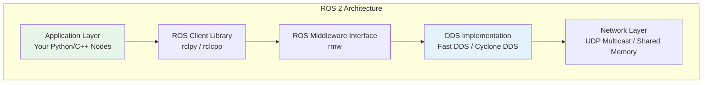
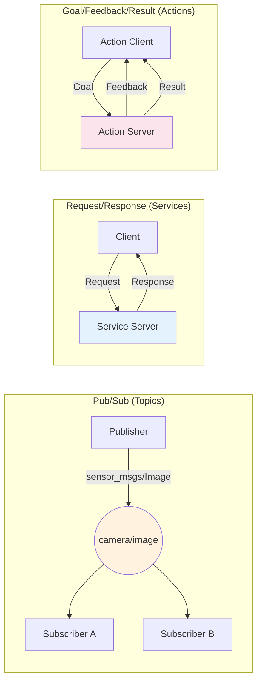
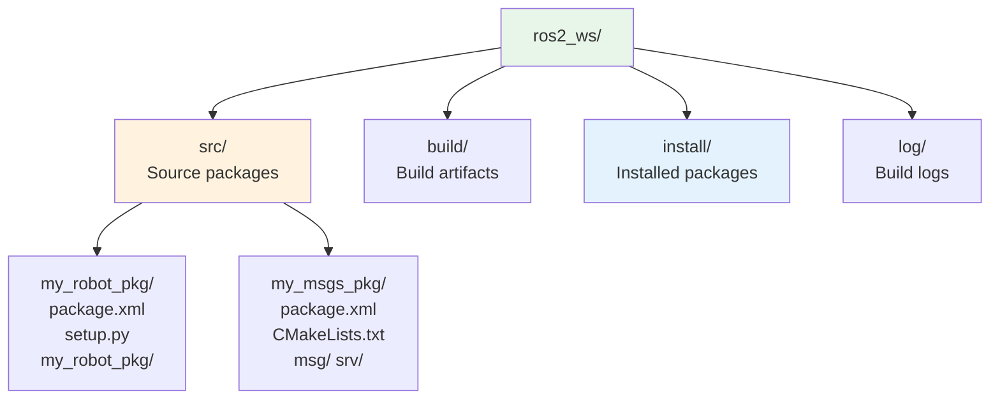

# Module 1: The Robotic Nervous System (ROS 2)

## Learning Objectives

After completing this module, you will be able to:

- **Install and configure** a ROS 2 Humble workspace on Ubuntu 22.04
- **Implement publisher/subscriber** communication patterns using `rclpy`
- **Create custom message types** and service interfaces
- **Launch multi-node systems** with Python launch files and parameters
- **Visualize robot state** with RViz2 and debug with ROS 2 CLI tools

**Estimated completion time**: 6–8 hours

---

## Theory

### ROS 2 Architecture Overview

The Robot Operating System 2 (ROS 2) is a middleware framework that provides the communication layer for robot software. It is not an operating system in the traditional sense. ROS 2 is a set of libraries and tools that help you build robot applications by connecting independent processes (called **nodes**) through well-defined communication patterns.

ROS 2 replaced its predecessor (ROS 1) to address critical limitations: no real-time support, single-point-of-failure architecture, and poor security. ROS 2 achieves this by building on top of the **Data Distribution Service (DDS)** standard, an industry protocol used in aerospace, defense, and financial trading systems.

**Core concepts:**

| Concept | Description |
|---------|-------------|
| **Node** | A single-purpose process (e.g., camera driver, path planner, motor controller) |
| **Topic** | A named bus for streaming data. Nodes publish to and subscribe from topics. |
| **Service** | A request/response pattern. A client sends a request; a server returns a response. |
| **Action** | A long-running task with feedback. Combines a goal request, periodic feedback, and a final result. |
| **Parameter** | Runtime configuration values attached to nodes (e.g., camera resolution, PID gains) |
| **Package** | A build unit containing nodes, message definitions, launch files, and configuration |

**DDS Middleware Layer**

ROS 2 does not implement its own networking. Instead, it delegates message serialization and transport to a DDS implementation. The default is Fast DDS (by eProsima). DDS provides:

- **Automatic discovery**: Nodes find each other without a central server (unlike ROS 1's `roscore`)
- **Quality of Service (QoS)**: Configurable reliability, durability, and deadline policies per topic
- **Security**: Built-in authentication, encryption, and access control via SROS2

:::note Why DDS Matters
In ROS 1, all communication routed through a single `roscore` process. If it crashed, every node lost connectivity. ROS 2's DDS layer is fully distributed — there is no single point of failure. Each node discovers peers directly using multicast.
:::



*Figure: ROS 2 layered architecture. Your code interacts with `rclpy`/`rclcpp`, which communicates through the DDS middleware.*

---

### ROS 2 Communication Patterns

ROS 2 provides three communication patterns. Choosing the right one depends on your data flow requirements.

**1. Publisher/Subscriber (Topics)**

Use for **streaming data** — sensor readings, robot state, camera frames. Publishers send messages to a named topic. Any number of subscribers can receive those messages. This is asynchronous and decoupled: publishers do not know (or care) who is listening.

- **When to use**: Continuous data streams (sensor data at 10–100 Hz), one-to-many broadcast
- **Example**: A LiDAR driver publishes `LaserScan` messages. Both the navigation stack and a visualization tool subscribe.

**2. Service/Client (Services)**

Use for **one-shot requests** — querying a map, triggering a calibration, requesting a computation. The client sends a request and blocks until the server responds. This is synchronous.

- **When to use**: Infrequent requests that need a guaranteed response
- **Example**: A node requests the current map from the SLAM service

**3. Action Server/Client (Actions)**

Use for **long-running tasks** that need progress feedback — navigating to a goal, executing a manipulation sequence. The client sends a goal, receives periodic feedback, and eventually gets a result. Goals can be canceled mid-execution.

- **When to use**: Tasks that take seconds or minutes, need progress updates, or may need cancellation
- **Example**: A navigation action that reports distance-to-goal every second



*Figure: The three ROS 2 communication patterns. Topics are for streams, services for queries, actions for long tasks.*

:::tip Choosing the Right Pattern
**Rule of thumb**: If data flows continuously, use a topic. If you need exactly one answer, use a service. If the task takes more than a second and you want progress updates, use an action.
:::

---

### ROS 2 Workspace and Build System

A ROS 2 **workspace** is a directory structure where you develop packages. The build tool **colcon** compiles packages and manages dependencies.

**Workspace structure:**



*Figure: Standard ROS 2 workspace layout. Source code lives in `src/`, build outputs go to `build/` and `install/`.*

**Key commands:**

| Command | Purpose |
|---------|---------|
| `colcon build` | Build all packages in the workspace |
| `colcon build --packages-select my_pkg` | Build only one package |
| `colcon build --symlink-install` | Use symlinks instead of copies (faster iteration for Python) |
| `source install/setup.bash` | Load built packages into your shell environment |

**Package types:**

- **Python packages** (`ament_python`): Use `setup.py` and `setup.cfg`. Nodes are Python scripts.
- **C++ packages** (`ament_cmake`): Use `CMakeLists.txt`. Nodes are compiled binaries.
- **Interface packages** (`ament_cmake`): Define custom `.msg` and `.srv` files. Always use CMake even if your nodes are Python.

:::warning Source Your Workspace
After every build, you **must** run `source install/setup.bash` in each terminal. Forgetting this is the #1 cause of "package not found" errors. Add it to your `.bashrc` for convenience — but remember to re-source after rebuilding.
:::

---

## Tutorials

### Tutorial 1: Setting Up Your ROS 2 Workspace

**Goal**: Install ROS 2 Humble and create a development workspace.

**Prerequisites**: Ubuntu 22.04 LTS (native or WSL2)

**Step 1** — Add the ROS 2 apt repository:

```bash
# Set locale
sudo apt update && sudo apt install locales
sudo locale-gen en_US en_US.UTF-8
sudo update-locale LC_ALL=en_US.UTF-8 LANG=en_US.UTF-8
export LANG=en_US.UTF-8

# Add ROS 2 GPG key
sudo apt install software-properties-common
sudo add-apt-repository universe
sudo apt update && sudo apt install curl -y
sudo curl -sSL https://raw.githubusercontent.com/ros/rosdistro/master/ros.key \
  -o /usr/share/keyrings/ros-archive-keyring.gpg

# Add repository to sources
echo "deb [arch=$(dpkg --print-architecture) \
  signed-by=/usr/share/keyrings/ros-archive-keyring.gpg] \
  http://packages.ros.org/ros2/ubuntu \
  $(. /etc/os-release && echo $UBUNTU_CODENAME) main" \
  | sudo tee /etc/apt/sources.list.d/ros2.list > /dev/null
```

**Step 2** — Install ROS 2 Humble Desktop:

```bash
sudo apt update
sudo apt install ros-humble-desktop python3-colcon-common-extensions -y
```

**Step 3** — Source the ROS 2 environment:

```bash
source /opt/ros/humble/setup.bash
# Add to .bashrc for persistence:
echo "source /opt/ros/humble/setup.bash" >> ~/.bashrc
```

**Step 4** — Verify the installation:

```bash
ros2 run demo_nodes_cpp talker
```

Expected output:

```text
[INFO] [1700000000.000000000] [talker]: Publishing: 'Hello World: 1'
[INFO] [1700000000.000000000] [talker]: Publishing: 'Hello World: 2'
[INFO] [1700000000.000000000] [talker]: Publishing: 'Hello World: 3'
```

**Step 5** — Create your workspace:

```bash
mkdir -p ~/ros2_ws/src
cd ~/ros2_ws
colcon build
source install/setup.bash
```

Expected output:

```text
Starting >>> (no packages found)
Summary: 0 packages finished
```

The empty build confirms colcon is working. You will add packages to `src/` in the next tutorials.

---

### Tutorial 2: Your First Publisher Node

**Goal**: Create a Python node that publishes simulated sensor data to a topic.

**Step 1** — Create a new package:

```bash
cd ~/ros2_ws/src
ros2 pkg create --build-type ament_python --node-name sensor_publisher my_robot_pkg
```

Expected output:

```text
going to create a new package
package name: my_robot_pkg
...
creating ./my_robot_pkg/my_robot_pkg/sensor_publisher.py
```

**Step 2** — Edit the publisher node. Replace the contents of `my_robot_pkg/my_robot_pkg/sensor_publisher.py`:

```python
"""Simulated temperature sensor publisher node."""

import rclpy
from rclpy.node import Node
from std_msgs.msg import Float64


class SensorPublisher(Node):
    """Publishes simulated temperature readings at 2 Hz."""

    def __init__(self):
        super().__init__('sensor_publisher')

        # Create a publisher on the 'temperature' topic
        self.publisher_ = self.create_publisher(Float64, 'temperature', 10)

        # Timer fires every 0.5 seconds (2 Hz)
        self.timer = self.create_timer(0.5, self.timer_callback)

        # Simulated temperature starting value
        self.temperature = 20.0
        self.get_logger().info('Sensor publisher started. Publishing to /temperature')

    def timer_callback(self):
        """Called every 0.5s. Publishes a simulated temperature reading."""
        import random

        # Simulate sensor noise: ±0.5 degrees
        self.temperature += random.uniform(-0.5, 0.5)

        msg = Float64()
        msg.data = round(self.temperature, 2)

        self.publisher_.publish(msg)
        self.get_logger().info(f'Published: {msg.data}°C')


def main(args=None):
    rclpy.init(args=args)
    node = SensorPublisher()

    try:
        rclpy.spin(node)
    except KeyboardInterrupt:
        pass
    finally:
        node.destroy_node()
        rclpy.shutdown()


if __name__ == '__main__':
    main()
```

**Step 3** — Build and run:

```bash
cd ~/ros2_ws
colcon build --packages-select my_robot_pkg --symlink-install
source install/setup.bash
ros2 run my_robot_pkg sensor_publisher
```

Expected output:

```text
[INFO] [sensor_publisher]: Sensor publisher started. Publishing to /temperature
[INFO] [sensor_publisher]: Published: 20.34°C
[INFO] [sensor_publisher]: Published: 19.87°C
[INFO] [sensor_publisher]: Published: 20.12°C
```

**Step 4** — In a second terminal, verify the topic:

```bash
source ~/ros2_ws/install/setup.bash
ros2 topic echo /temperature
```

Expected output:

```text
data: 20.34
---
data: 19.87
---
data: 20.12
---
```

:::tip Symlink Install
The `--symlink-install` flag creates symbolic links instead of copying files. For Python packages, this means you can edit your code and re-run without rebuilding. Use it during development.
:::

---

### Tutorial 3: Your First Subscriber Node

**Goal**: Create a node that receives temperature data and logs warnings for high readings.

**Step 1** — Create the subscriber. Add a new file `my_robot_pkg/my_robot_pkg/temperature_monitor.py`:

```python
"""Temperature monitoring subscriber node."""

import rclpy
from rclpy.node import Node
from std_msgs.msg import Float64

# Threshold above which we issue a warning
TEMP_WARNING_THRESHOLD = 22.0


class TemperatureMonitor(Node):
    """Subscribes to temperature topic and warns on high readings."""

    def __init__(self):
        super().__init__('temperature_monitor')

        # Subscribe to the 'temperature' topic
        self.subscription = self.create_subscription(
            Float64,
            'temperature',
            self.listener_callback,
            10  # QoS queue depth
        )

        self.reading_count = 0
        self.get_logger().info('Temperature monitor started. Listening on /temperature')

    def listener_callback(self, msg: Float64):
        """Called each time a message arrives on /temperature."""
        self.reading_count += 1
        temp = msg.data

        if temp > TEMP_WARNING_THRESHOLD:
            self.get_logger().warn(
                f'HIGH TEMP [{self.reading_count}]: {temp}°C exceeds {TEMP_WARNING_THRESHOLD}°C!'
            )
        else:
            self.get_logger().info(
                f'Reading [{self.reading_count}]: {temp}°C (normal)'
            )


def main(args=None):
    rclpy.init(args=args)
    node = TemperatureMonitor()

    try:
        rclpy.spin(node)
    except KeyboardInterrupt:
        pass
    finally:
        node.destroy_node()
        rclpy.shutdown()


if __name__ == '__main__':
    main()
```

**Step 2** — Register the new node. Edit `my_robot_pkg/setup.py` to add the entry point:

```python
entry_points={
    'console_scripts': [
        'sensor_publisher = my_robot_pkg.sensor_publisher:main',
        'temperature_monitor = my_robot_pkg.temperature_monitor:main',
    ],
},
```

**Step 3** — Build and run both nodes:

```bash
cd ~/ros2_ws
colcon build --packages-select my_robot_pkg --symlink-install
source install/setup.bash

# Terminal 1:
ros2 run my_robot_pkg sensor_publisher

# Terminal 2 (new terminal, source workspace first):
source ~/ros2_ws/install/setup.bash
ros2 run my_robot_pkg temperature_monitor
```

Expected output in Terminal 2 (subscriber):

```text
[INFO] [temperature_monitor]: Temperature monitor started. Listening on /temperature
[INFO] [temperature_monitor]: Reading [1]: 20.34°C (normal)
[WARN] [temperature_monitor]: HIGH TEMP [2]: 22.41°C exceeds 22.0°C!
[INFO] [temperature_monitor]: Reading [3]: 21.12°C (normal)
```

---

### Tutorial 4: Custom Messages and Services

**Goal**: Define a custom message type for sensor data and a service for querying sensor status.

**Step 1** — Create an interface package (message/service definitions require CMake):

```bash
cd ~/ros2_ws/src
ros2 pkg create --build-type ament_cmake my_robot_interfaces
mkdir -p my_robot_interfaces/msg my_robot_interfaces/srv
```

**Step 2** — Define a custom message. Create `my_robot_interfaces/msg/SensorReading.msg`:

```text
# SensorReading.msg - A timestamped sensor measurement
string sensor_id          # Unique identifier for the sensor
float64 value             # Measured value
string unit               # Unit of measurement (e.g., "celsius", "meters")
builtin_interfaces/Time timestamp  # When the reading was taken
```

**Step 3** — Define a custom service. Create `my_robot_interfaces/srv/GetSensorStatus.srv`:

```text
# GetSensorStatus.srv - Query current status of a sensor
string sensor_id          # Which sensor to query
---
bool is_active            # Whether sensor is currently publishing
float64 last_value        # Most recent reading
string status_message     # Human-readable status
```

**Step 4** — Configure the CMake build. Edit `my_robot_interfaces/CMakeLists.txt`:

```cmake
cmake_minimum_required(VERSION 3.8)
project(my_robot_interfaces)

find_package(ament_cmake REQUIRED)
find_package(builtin_interfaces REQUIRED)
find_package(rosidl_default_generators REQUIRED)

rosidl_generate_interfaces(${PROJECT_NAME}
  "msg/SensorReading.msg"
  "srv/GetSensorStatus.srv"
  DEPENDENCIES builtin_interfaces
)

ament_package()
```

**Step 5** — Update `my_robot_interfaces/package.xml` to add required dependencies:

```xml
<?xml version="1.0"?>
<package format="3">
  <name>my_robot_interfaces</name>
  <version>0.0.1</version>
  <description>Custom messages and services for my_robot_pkg</description>
  <maintainer email="student@university.edu">student</maintainer>
  <license>Apache-2.0</license>

  <buildtool_depend>ament_cmake</buildtool_depend>
  <buildtool_depend>rosidl_default_generators</buildtool_depend>

  <depend>builtin_interfaces</depend>

  <member_of_group>rosidl_interface_packages</member_of_group>

  <export>
    <build_type>ament_cmake</build_type>
  </export>
</package>
```

**Step 6** — Build and verify:

```bash
cd ~/ros2_ws
colcon build --packages-select my_robot_interfaces
source install/setup.bash

# Verify the message is available:
ros2 interface show my_robot_interfaces/msg/SensorReading
```

Expected output:

```text
string sensor_id
float64 value
string unit
builtin_interfaces/Time timestamp
```

**Step 7** — Implement a service server. Create `my_robot_pkg/my_robot_pkg/sensor_status_server.py`:

```python
"""Service server that reports sensor status."""

import rclpy
from rclpy.node import Node
from my_robot_interfaces.srv import GetSensorStatus


class SensorStatusServer(Node):
    """Service server that responds to sensor status queries."""

    def __init__(self):
        super().__init__('sensor_status_server')
        self.srv = self.create_service(
            GetSensorStatus,
            'get_sensor_status',
            self.status_callback
        )
        # Simulated sensor state
        self.sensors = {
            'temp_01': {'active': True, 'value': 21.5},
            'temp_02': {'active': False, 'value': 0.0},
        }
        self.get_logger().info('Sensor status service ready.')

    def status_callback(self, request, response):
        """Handle incoming status requests."""
        sensor_id = request.sensor_id
        self.get_logger().info(f'Status request for: {sensor_id}')

        if sensor_id in self.sensors:
            sensor = self.sensors[sensor_id]
            response.is_active = sensor['active']
            response.last_value = sensor['value']
            response.status_message = (
                f"Sensor {sensor_id} is {'active' if sensor['active'] else 'inactive'}"
            )
        else:
            response.is_active = False
            response.last_value = 0.0
            response.status_message = f"Sensor {sensor_id} not found"

        return response


def main(args=None):
    rclpy.init(args=args)
    node = SensorStatusServer()
    try:
        rclpy.spin(node)
    except KeyboardInterrupt:
        pass
    finally:
        node.destroy_node()
        rclpy.shutdown()


if __name__ == '__main__':
    main()
```

**Step 8** — Add the entry point to `setup.py` and test:

```bash
# After adding 'sensor_status_server = my_robot_pkg.sensor_status_server:main'
# to setup.py entry_points, rebuild:
colcon build --packages-select my_robot_pkg --symlink-install
source install/setup.bash

# Terminal 1 - start the server:
ros2 run my_robot_pkg sensor_status_server

# Terminal 2 - call the service:
ros2 service call /get_sensor_status my_robot_interfaces/srv/GetSensorStatus \
  "{sensor_id: 'temp_01'}"
```

Expected output (Terminal 2):

```text
requester: making request: my_robot_interfaces.srv.GetSensorStatus_Request(sensor_id='temp_01')

response:
my_robot_interfaces.srv.GetSensorStatus_Response(
  is_active=True,
  last_value=21.5,
  status_message='Sensor temp_01 is active'
)
```

---

### Tutorial 5: Launch Files and Multi-Node Systems

**Goal**: Write a Python launch file that starts multiple nodes with configurable parameters.

**Step 1** — Create a launch directory in your package:

```bash
mkdir -p ~/ros2_ws/src/my_robot_pkg/launch
```

**Step 2** — Create `my_robot_pkg/launch/sensor_system.launch.py`:

```python
"""Launch file for the sensor monitoring system."""

from launch import LaunchDescription
from launch_ros.actions import Node
from launch.actions import LogInfo


def generate_launch_description():
    """Start the sensor publisher, monitor, and status server."""
    return LaunchDescription([
        LogInfo(msg='Starting sensor monitoring system...'),

        # Temperature sensor publisher
        Node(
            package='my_robot_pkg',
            executable='sensor_publisher',
            name='temp_sensor_01',
            output='screen',
            parameters=[{
                'publish_rate': 2.0,
            }],
        ),

        # Temperature monitor subscriber
        Node(
            package='my_robot_pkg',
            executable='temperature_monitor',
            name='temp_monitor',
            output='screen',
        ),

        # Sensor status service
        Node(
            package='my_robot_pkg',
            executable='sensor_status_server',
            name='status_server',
            output='screen',
        ),
    ])
```

**Step 3** — Register the launch file. Add to `setup.py`:

```python
import os
from glob import glob

# Inside setup():
data_files=[
    ('share/ament_index/resource_index/packages',
        ['resource/my_robot_pkg']),
    ('share/my_robot_pkg', ['package.xml']),
    # Add launch files:
    (os.path.join('share', 'my_robot_pkg', 'launch'),
        glob(os.path.join('launch', '*.launch.py'))),
],
```

**Step 4** — Build and launch:

```bash
cd ~/ros2_ws
colcon build --packages-select my_robot_pkg --symlink-install
source install/setup.bash

ros2 launch my_robot_pkg sensor_system.launch.py
```

Expected output:

```text
[INFO] [launch]: Starting sensor monitoring system...
[INFO] [temp_sensor_01]: Sensor publisher started. Publishing to /temperature
[INFO] [temp_monitor]: Temperature monitor started. Listening on /temperature
[INFO] [status_server]: Sensor status service ready.
[INFO] [temp_sensor_01]: Published: 20.34°C
[INFO] [temp_monitor]: Reading [1]: 20.34°C (normal)
```

**Step 5** — Verify the running system. In a separate terminal:

```bash
source ~/ros2_ws/install/setup.bash

# List all running nodes:
ros2 node list

# List all active topics:
ros2 topic list

# Inspect the computation graph:
ros2 topic info /temperature
```

Expected output:

```text
# ros2 node list
/temp_sensor_01
/temp_monitor
/status_server

# ros2 topic list
/temperature
/parameter_events
/rosout

# ros2 topic info /temperature
Type: std_msgs/msg/Float64
Publisher count: 1
Subscription count: 1
```

---

### Best Practices and Common Mistakes

:::warning Source Your Workspace in Every Terminal
The most common ROS 2 error is forgetting to source `install/setup.bash`. Every new terminal needs this command. Without it, ROS 2 cannot find your packages, nodes, or custom messages.

```bash
# Always run this after opening a new terminal:
source ~/ros2_ws/install/setup.bash
```
:::

:::tip Use CLI Tools for Debugging
ROS 2 includes powerful command-line tools for inspecting your running system:

```bash
ros2 node list           # See all active nodes
ros2 topic list          # See all active topics
ros2 topic echo /topic   # Print messages on a topic
ros2 topic hz /topic     # Measure publishing rate
ros2 service list        # See available services
ros2 param list          # See node parameters
ros2 doctor              # System diagnostics
```

Use `ros2 topic hz` to verify your nodes are publishing at the expected rate. Use `ros2 doctor` when things are not working — it checks for common configuration issues.
:::

:::warning DDS Domain ID
All ROS 2 nodes on the same network and same **ROS_DOMAIN_ID** can see each other. If you are working in a shared lab or classroom, set a unique domain ID to avoid interference:

```bash
export ROS_DOMAIN_ID=42  # Use any number 0-101
```

Add this to your `.bashrc` to persist it across terminals.
:::

---

## Common Errors & Troubleshooting

### 1. "Package not found" After Building

**Symptom**: `ros2 run my_robot_pkg sensor_publisher` returns `Package 'my_robot_pkg' not found`.

**Cause**: You forgot to source the workspace after building.

**Fix**:

```bash
source ~/ros2_ws/install/setup.bash
# Then retry:
ros2 run my_robot_pkg sensor_publisher
```

**Prevention**: Add `source ~/ros2_ws/install/setup.bash` to your `~/.bashrc`.

---

### 2. "No executable found" in Package

**Symptom**: `ros2 run my_robot_pkg sensor_publisher` returns `No executable found`.

**Cause**: The node is not registered in `setup.py` entry points, or the entry point name does not match the function.

**Fix**: Verify `setup.py` contains the correct entry:

```python
entry_points={
    'console_scripts': [
        'sensor_publisher = my_robot_pkg.sensor_publisher:main',
    ],
},
```

Then rebuild:

```bash
colcon build --packages-select my_robot_pkg
source install/setup.bash
```

---

### 3. Topic Not Showing in `ros2 topic list`

**Symptom**: Your publisher is running but `ros2 topic list` does not show the topic.

**Cause**: The publisher and the terminal running `ros2 topic list` are on different DDS domain IDs.

**Fix**: Verify both terminals use the same `ROS_DOMAIN_ID`:

```bash
echo $ROS_DOMAIN_ID
# If empty, default is 0. Set explicitly:
export ROS_DOMAIN_ID=0
```

Also check that both terminals have sourced the same ROS 2 installation.

---

### 4. QoS Incompatibility Between Publisher and Subscriber

**Symptom**: Subscriber connects to a topic but never receives messages. No error message appears.

**Cause**: Mismatched Quality of Service (QoS) profiles. A common case: the publisher uses `BEST_EFFORT` reliability while the subscriber uses `RELIABLE`.

**Fix**: Explicitly match QoS profiles. Use `ros2 topic info -v /topic_name` to inspect the publisher's QoS, then configure the subscriber to match:

```python
from rclpy.qos import QoSProfile, ReliabilityPolicy

qos = QoSProfile(
    depth=10,
    reliability=ReliabilityPolicy.BEST_EFFORT  # Match the publisher
)

self.subscription = self.create_subscription(
    Float64, 'temperature', self.callback, qos
)
```

---

### 5. `colcon build` Fails with Missing Dependencies

**Symptom**: Build fails with `Could not find a package configuration file provided by "some_package"`.

**Cause**: A dependency listed in `package.xml` is not installed.

**Fix**: Install the missing dependency:

```bash
# For ROS 2 packages:
sudo apt install ros-humble-<package-name>

# For Python packages:
pip install <package-name>

# Then rebuild:
cd ~/ros2_ws
colcon build
```

**Prevention**: Always declare dependencies in `package.xml`. Use `rosdep` to install all dependencies at once:

```bash
cd ~/ros2_ws
rosdep install --from-paths src --ignore-src -y
```

---

## Exercises

### Exercise 1: Build a Temperature Monitor System

**Objective**: Create a publisher/subscriber system that monitors multiple temperature sensors and raises alerts.

**Requirements**:

1. Create a publisher node called `multi_sensor_pub` that:
   - Publishes to 3 topics: `/sensor/temp_room`, `/sensor/temp_cpu`, `/sensor/temp_gpu`
   - Uses the custom `SensorReading` message type from Tutorial 4
   - Publishes at 1 Hz with simulated data (room: 18–25°C, CPU: 40–90°C, GPU: 30–85°C)

2. Create a subscriber node called `alert_monitor` that:
   - Subscribes to all 3 temperature topics
   - Logs a `WARNING` when any sensor exceeds its threshold (room: 28°C, CPU: 80°C, GPU: 80°C)
   - Logs a `DANGER` when any sensor exceeds a critical threshold (room: 35°C, CPU: 95°C, GPU: 95°C)

**Expected output**:

```text
[INFO] [alert_monitor]: [temp_room] 22.3°C - normal
[INFO] [alert_monitor]: [temp_cpu] 65.1°C - normal
[WARN] [alert_monitor]: [temp_gpu] 82.4°C - WARNING: above threshold!
```

**Success criteria**: Both nodes run simultaneously. Alerts appear when thresholds are exceeded. `ros2 topic list` shows all 3 topics.

---

### Exercise 2: Robot Command Service

**Objective**: Implement a service that accepts movement commands and returns execution status.

**Requirements**:

1. Define a custom service `RobotCommand.srv`:

   ```text
   # Request
   string command       # "move_forward", "turn_left", "turn_right", "stop"
   float64 value        # Distance (meters) or angle (degrees)
   ---
   # Response
   bool success
   string message
   float64 execution_time_sec
   ```

2. Implement a service server that:
   - Validates the command (only accepts the 4 defined commands)
   - Simulates execution by sleeping for `value * 0.1` seconds
   - Returns success status and execution time

3. Test with `ros2 service call`:

   ```bash
   ros2 service call /robot_command my_robot_interfaces/srv/RobotCommand \
     "{command: 'move_forward', value: 5.0}"
   ```

**Success criteria**: Service accepts valid commands and rejects unknown ones. Execution time is proportional to the command value.

---

### Exercise 3: Multi-Sensor Launch System

**Objective**: Create a launch file that starts 3 or more simulated sensor nodes with different configurations.

**Requirements**:

1. Create a launch file `multi_sensor.launch.py` that starts:
   - 3 temperature sensor publishers (room, CPU, GPU) with different topic names
   - 1 alert monitor subscriber
   - 1 sensor status service server

2. Use launch parameters to configure:
   - Publishing rate for each sensor (room: 1 Hz, CPU: 2 Hz, GPU: 2 Hz)
   - Warning thresholds per sensor

3. Include launch arguments so the user can override defaults:

   ```bash
   ros2 launch my_robot_pkg multi_sensor.launch.py room_rate:=0.5
   ```

**Success criteria**: All 5 nodes start with a single launch command. `ros2 node list` shows all nodes. Overriding launch arguments changes node behavior.

---

## Official Documentation & Resources

**Estimated module completion time**: 6–8 hours

### Core References

- [ROS 2 Humble Documentation](https://docs.ros.org/en/humble/) — Official guides, tutorials, and API reference
- [ROS 2 Tutorials (Beginner)](https://docs.ros.org/en/humble/Tutorials/Beginner-CLI-Tools.html) — CLI tools, nodes, topics, services
- [ROS 2 Tutorials (Intermediate)](https://docs.ros.org/en/humble/Tutorials/Intermediate.html) — Launch files, parameters, custom interfaces
- [rclpy API Reference](https://docs.ros2.org/latest/api/rclpy/) — Python client library documentation
- [ROS 2 Design](https://design.ros2.org/) — Architectural decisions and design documents

### Community

- [ROS Discourse](https://discourse.ros.org/) — Official discussion forum for questions and announcements
- [ROS Answers](https://answers.ros.org/) — Q&A for specific technical problems
- [Robotics Stack Exchange](https://robotics.stackexchange.com/) — Broader robotics Q&A

### Tools

- [RViz2](https://docs.ros.org/en/humble/Tutorials/Intermediate/RViz/RViz-Main.html) — 3D visualization tool for ROS 2
- [rqt](https://docs.ros.org/en/humble/Concepts/Intermediate/About-RQt.html) — GUI toolkit for ROS 2 (topic monitor, node graph, parameter editor)
- [rosbag2](https://docs.ros.org/en/humble/Tutorials/Beginner-CLI-Tools/Recording-And-Playing-Back-Data/Recording-And-Playing-Back-Data.html) — Record and replay message data

---

**Next**: [Module 2 — The Digital Twin (Gazebo & Unity)](./module2-gazebo-unity) teaches you to build simulated robot environments for testing and training.
