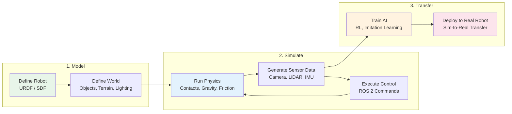
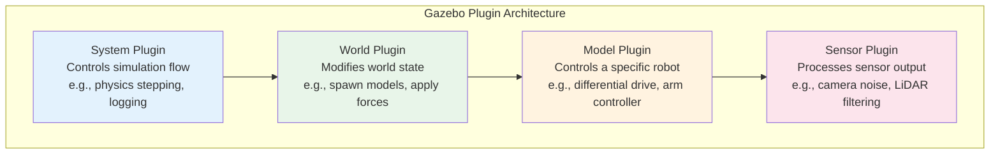
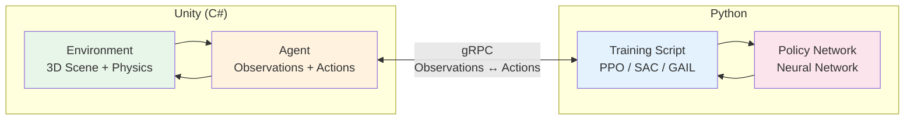

# Module 2: The Digital Twin (Gazebo & Unity)

## Learning Objectives

After completing this module, you will be able to:

- **Define** what a digital twin is and explain its role in robot development
- **Create robot models** using URDF (Unified Robot Description Format)
- **Build simulated environments** in Gazebo Harmonic with physics, sensors, and obstacles
- **Control simulated robots** through ROS 2 topics and services
- **Add virtual sensors** (camera, LiDAR, IMU) and read their data via ROS 2
- **Set up Unity ML-Agents** for reinforcement learning training of robot behaviors
- **Compare Gazebo and Unity** and choose the right simulator for a given task

**Estimated completion time**: 8–10 hours

**Prerequisites**: [Module 1 — ROS 2](./module1-ros2) (nodes, topics, services, launch files)

---

## Theory

### What is a Digital Twin?

A **digital twin** is a virtual replica of a physical system that mirrors its geometry, physics, sensors, and behavior in real time. In robotics, the digital twin is a simulated robot operating inside a simulated world. You send the same commands to the simulated robot that you would send to the real one, and it responds with the same sensor data — camera images, LiDAR scans, joint positions — that the real robot would produce.

This concept transforms how we develop robots. Without simulation, every line of code must be tested on physical hardware. Hardware is expensive, fragile, slow to reset, and dangerous when algorithms fail. A robot arm swinging unexpectedly can injure a person or destroy itself. Simulation removes these constraints.

**Key benefits of digital twins in robotics:**

| Benefit | Without Simulation | With Digital Twin |
|---------|-------------------|-------------------|
| **Safety** | Test on real hardware, risk damage | Test dangerous behaviors safely |
| **Speed** | One robot, one experiment at a time | Thousands of parallel instances on GPUs |
| **Cost** | Wear and tear on motors, sensors, structures | Zero physical degradation |
| **Reproducibility** | Environmental conditions vary each test | Reset to identical state every run |
| **Data generation** | Manual labeling of real images | Automatic ground-truth labels from renderer |

The digital twin workflow follows three stages:



*Figure: The digital twin workflow. Model your robot and world, simulate physics and sensors, then transfer trained policies to real hardware.*

:::note Digital Twin vs. Simulation
The term "digital twin" implies a tight coupling — the virtual model stays synchronized with the real system, updating in real time. In practice, many robotics workflows use simulation without real-time coupling (offline training, batch evaluation). We use both terms in this module, but the core tools and techniques are the same.
:::

---

### Gazebo Simulation Fundamentals

**Gazebo** (now called "Gazebo Harmonic" in the latest release) is the most widely used open-source robotics simulator. It is tightly integrated with ROS 2 and provides physics simulation, sensor models, and a 3D rendering engine.

**Core Architecture:**

Gazebo runs as a server process that steps through physics simulation at a fixed timestep (default: 1 ms). Clients (your ROS 2 nodes, GUI, CLI tools) communicate with the server through a transport layer. This separation means you can run "headless" simulations on a server without a display — essential for cloud-based training.

**Robot Description Formats:**

Gazebo understands two formats for describing robots:

- **URDF (Unified Robot Description Format)**: The ROS standard. Defines links (rigid bodies), joints (connections between links), visual geometry, collision geometry, and inertial properties in XML. Simpler but limited — cannot define world elements or advanced physics properties.

- **SDF (Simulation Description Format)**: Gazebo's native format. A superset of URDF that can describe entire worlds (ground planes, lighting, multiple robots, static objects). More powerful but less portable across tools.

In practice, most teams write URDF for their robot (for ROS tool compatibility) and SDF for the world.

**Physics Engines:**

Gazebo supports multiple physics engines:

| Engine | Strengths | Use Case |
|--------|-----------|----------|
| **DART** | Accurate contact dynamics, stable | Manipulation, grasping |
| **Bullet** | Fast, widely used in games | Large environments, locomotion |
| **ODE** | Legacy default, well-tested | General purpose |
| **TPE** | Trivial physics, very fast | Sensor-only simulation (no contacts) |

**Plugin System:**

Gazebo's functionality extends through plugins that attach to different levels:



*Figure: Gazebo plugin hierarchy. System plugins control the simulation, world plugins modify the environment, model plugins control robots, sensor plugins process data.*

**Sensor Models:**

Gazebo provides realistic models for common robot sensors:

- **Camera**: RGB images with configurable resolution, field of view, noise
- **Depth Camera**: RGB + depth per pixel (simulates Intel RealSense, Microsoft Kinect)
- **LiDAR**: 2D and 3D point clouds with configurable range, resolution, noise
- **IMU**: Accelerometer + gyroscope readings with configurable drift and noise
- **Contact Sensor**: Reports when a link touches another object
- **GPS**: Simulated global position with configurable accuracy

Each sensor publishes data to a Gazebo transport topic, which the `ros_gz_bridge` package converts to ROS 2 topics.

:::warning Physics Timestep
The physics timestep controls simulation accuracy. Smaller timesteps (0.0001s) are more accurate but slower. Larger timesteps (0.01s) are faster but can cause objects to pass through each other or joints to become unstable. The default (0.001s) works for most cases. Only reduce it if you see physics glitches.
:::

---

### Unity for Robotics Simulation

**Unity** is a commercial game engine repurposed for robotics simulation. While Gazebo excels at physics-accurate simulation with ROS integration, Unity provides superior rendering quality and a mature machine learning framework called **ML-Agents**.

**Why Unity for Robotics?**

1. **Photorealistic rendering**: Unity's High Definition Render Pipeline (HDRP) produces images much closer to real camera footage than Gazebo. This matters for training vision-based AI models — the closer training images match reality, the better sim-to-real transfer.

2. **ML-Agents Toolkit**: A Python package that connects Unity environments to reinforcement learning (RL) training frameworks. You define observations, actions, and rewards inside Unity, then train policies using PPO, SAC, or other algorithms from Python.

3. **Synthetic data generation**: Unity Perception package automatically generates labeled training datasets — bounding boxes, segmentation masks, depth maps — from simulated scenes with randomized lighting, textures, and object positions.

4. **Asset ecosystem**: The Unity Asset Store provides thousands of 3D models (warehouses, kitchens, outdoor environments) that can serve as robot testing environments.

**ML-Agents Architecture:**



*Figure: Unity ML-Agents training pipeline. The Unity environment sends observations to Python, which returns actions from the policy network. This loop repeats millions of times during training.*

**Unity + ROS 2 Integration:**

Unity communicates with ROS 2 through the **Unity Robotics Hub** package, which provides:

- **ROS TCP Connector**: Publishes and subscribes to ROS 2 topics from C# scripts
- **URDF Importer**: Loads URDF robot models directly into Unity scenes
- **Message types**: Supports standard ROS message types (sensor_msgs, geometry_msgs, etc.)

:::tip When to Choose Unity
Use Unity when your primary goal is training vision-based AI models or when you need photorealistic rendering for synthetic data generation. If your goal is testing ROS 2 control code with accurate physics, Gazebo is the better choice (see comparison below).
:::

---

### Gazebo vs Unity: When to Use Which

Both simulators have strengths. The right choice depends on your project goals.

| Feature | Gazebo Harmonic | Unity |
|---------|----------------|-------|
| **ROS 2 integration** | Native, first-class | Via plugin (Unity Robotics Hub) |
| **Physics accuracy** | High (DART, Bullet engines) | Medium (PhysX, configurable) |
| **Rendering quality** | Basic 3D | Photorealistic (HDRP) |
| **ML training support** | Manual setup via ROS | Built-in (ML-Agents toolkit) |
| **Synthetic data** | Limited | Excellent (Perception package) |
| **Headless simulation** | Yes (server mode) | Yes (batch mode) |
| **Cost** | Free, open-source | Free for education/personal |
| **Learning curve** | Moderate (XML config) | Steep (C# + Unity Editor) |
| **Community** | Robotics-focused | Game dev + growing robotics |

**Decision framework:**

- **Testing ROS 2 code** → Gazebo (native integration, easier setup)
- **Training RL policies** → Unity ML-Agents (built-in training loop) or Isaac Sim (Module 3)
- **Generating labeled vision data** → Unity Perception (photorealistic rendering)
- **Sim-to-real for manipulation** → Gazebo with DART physics (accurate contact models)
- **Full pipeline (sim + train + deploy)** → NVIDIA Isaac Sim (Module 3)

:::danger The Sim-to-Real Gap
No simulator perfectly matches reality. Key differences include:
- **Friction and contact**: Simulated surfaces are smoother than real ones
- **Sensor noise**: Real cameras have lens distortion, motion blur, and varying exposure
- **Actuator dynamics**: Real motors have backlash, latency, and torque limits not modeled in simulation
- **Lighting**: Real environments have complex, changing illumination

Techniques to minimize this gap (domain randomization, system identification) are covered in Module 3.
:::

---

## Tutorials

### Tutorial 1: Installing Gazebo and ROS 2 Integration

**Goal**: Install Gazebo Harmonic and the ROS 2 bridge packages.

**Prerequisites**: ROS 2 Humble installed (from Module 1, Tutorial 1)

**Step 1** — Install Gazebo Harmonic:

```bash
# Add Gazebo repository
sudo apt update
sudo apt install -y wget lsb-release gnupg

sudo wget https://packages.osrfoundation.org/gazebo.gpg \
  -O /usr/share/keyrings/pkgs-osrf-archive-keyring.gpg

echo "deb [arch=$(dpkg --print-architecture) \
  signed-by=/usr/share/keyrings/pkgs-osrf-archive-keyring.gpg] \
  http://packages.osrfoundation.org/gazebo/ubuntu-stable \
  $(lsb_release -cs) main" \
  | sudo tee /etc/apt/sources.list.d/gazebo-stable.list > /dev/null

sudo apt update
sudo apt install -y gz-harmonic
```

**Step 2** — Install the ROS 2 – Gazebo bridge:

```bash
sudo apt install -y ros-humble-ros-gz
```

This installs:
- `ros_gz_bridge`: Converts between Gazebo transport topics and ROS 2 topics
- `ros_gz_sim`: Launch and control Gazebo from ROS 2 launch files
- `ros_gz_image`: Bridge for camera image topics

**Step 3** — Verify the installation:

```bash
# Start Gazebo with an empty world:
gz sim empty.sdf
```

Expected result: Gazebo GUI opens showing an empty ground plane with a coordinate frame. Close the window to continue.

**Step 4** — Test the ROS 2 bridge:

```bash
# Terminal 1: Start Gazebo with a demo world
gz sim shapes.sdf

# Terminal 2: Start the bridge for the clock topic
source /opt/ros/humble/setup.bash
ros2 run ros_gz_bridge parameter_bridge /clock@rosgraph_msgs/msg/Clock@gz.msgs.Clock

# Terminal 3: Verify clock messages arrive in ROS 2
source /opt/ros/humble/setup.bash
ros2 topic echo /clock
```

Expected output (Terminal 3):

```text
clock:
  sec: 5
  nanosec: 432000000
---
clock:
  sec: 5
  nanosec: 433000000
---
```

This confirms Gazebo simulation time is flowing to ROS 2.

---

### Tutorial 2: Creating Your First URDF Robot Model

**Goal**: Write a URDF file that defines a simple two-wheeled robot and visualize it.

**Step 1** — Create a package for your robot description:

```bash
cd ~/ros2_ws/src
ros2 pkg create --build-type ament_python my_robot_description
mkdir -p my_robot_description/urdf
mkdir -p my_robot_description/launch
```

**Step 2** — Write the URDF file. Create `my_robot_description/urdf/my_robot.urdf`:

```xml
<?xml version="1.0"?>
<robot name="my_robot" xmlns:xacro="http://www.ros.org/wiki/xacro">

  <!-- Base link: the robot body -->
  <link name="base_link">
    <visual>
      <geometry>
        <box size="0.3 0.2 0.1"/>
      </geometry>
      <material name="blue">
        <color rgba="0.2 0.4 0.8 1.0"/>
      </material>
    </visual>
    <collision>
      <geometry>
        <box size="0.3 0.2 0.1"/>
      </geometry>
    </collision>
    <inertial>
      <mass value="5.0"/>
      <inertia ixx="0.017" ixy="0" ixz="0"
               iyy="0.042" iyz="0" izz="0.054"/>
    </inertial>
  </link>

  <!-- Left wheel -->
  <link name="left_wheel">
    <visual>
      <geometry>
        <cylinder radius="0.05" length="0.02"/>
      </geometry>
      <material name="black">
        <color rgba="0.1 0.1 0.1 1.0"/>
      </material>
    </visual>
    <collision>
      <geometry>
        <cylinder radius="0.05" length="0.02"/>
      </geometry>
    </collision>
    <inertial>
      <mass value="0.5"/>
      <inertia ixx="0.0003" ixy="0" ixz="0"
               iyy="0.0003" iyz="0" izz="0.0006"/>
    </inertial>
  </link>

  <joint name="left_wheel_joint" type="continuous">
    <parent link="base_link"/>
    <child link="left_wheel"/>
    <origin xyz="0.0 0.12 -0.03" rpy="-1.5708 0 0"/>
    <axis xyz="0 0 1"/>
  </joint>

  <!-- Right wheel -->
  <link name="right_wheel">
    <visual>
      <geometry>
        <cylinder radius="0.05" length="0.02"/>
      </geometry>
      <material name="black">
        <color rgba="0.1 0.1 0.1 1.0"/>
      </material>
    </visual>
    <collision>
      <geometry>
        <cylinder radius="0.05" length="0.02"/>
      </geometry>
    </collision>
    <inertial>
      <mass value="0.5"/>
      <inertia ixx="0.0003" ixy="0" ixz="0"
               iyy="0.0003" iyz="0" izz="0.0006"/>
    </inertial>
  </link>

  <joint name="right_wheel_joint" type="continuous">
    <parent link="base_link"/>
    <child link="right_wheel"/>
    <origin xyz="0.0 -0.12 -0.03" rpy="-1.5708 0 0"/>
    <axis xyz="0 0 1"/>
  </joint>

  <!-- Caster wheel (passive support) -->
  <link name="caster">
    <visual>
      <geometry>
        <sphere radius="0.025"/>
      </geometry>
      <material name="white">
        <color rgba="0.9 0.9 0.9 1.0"/>
      </material>
    </visual>
    <collision>
      <geometry>
        <sphere radius="0.025"/>
      </geometry>
    </collision>
    <inertial>
      <mass value="0.2"/>
      <inertia ixx="0.00001" ixy="0" ixz="0"
               iyy="0.00001" iyz="0" izz="0.00001"/>
    </inertial>
  </link>

  <joint name="caster_joint" type="fixed">
    <parent link="base_link"/>
    <child link="caster"/>
    <origin xyz="-0.12 0 -0.055"/>
  </joint>

</robot>
```

**Step 3** — Create a launch file to view the robot. Create `my_robot_description/launch/display.launch.py`:

```python
"""Launch file to display robot in RViz2."""

import os
from ament_index_python.packages import get_package_share_directory
from launch import LaunchDescription
from launch_ros.actions import Node


def generate_launch_description():
    urdf_file = os.path.join(
        get_package_share_directory('my_robot_description'),
        'urdf', 'my_robot.urdf'
    )

    with open(urdf_file, 'r') as f:
        robot_description = f.read()

    return LaunchDescription([
        # Publish robot description to /robot_description
        Node(
            package='robot_state_publisher',
            executable='robot_state_publisher',
            parameters=[{'robot_description': robot_description}],
            output='screen',
        ),

        # Publish dummy joint states
        Node(
            package='joint_state_publisher_gui',
            executable='joint_state_publisher_gui',
            output='screen',
        ),

        # Launch RViz2
        Node(
            package='rviz2',
            executable='rviz2',
            output='screen',
        ),
    ])
```

**Step 4** — Update `setup.py` to include data files:

```python
import os
from glob import glob

data_files=[
    ('share/ament_index/resource_index/packages',
        ['resource/my_robot_description']),
    ('share/my_robot_description', ['package.xml']),
    (os.path.join('share', 'my_robot_description', 'urdf'),
        glob('urdf/*.urdf')),
    (os.path.join('share', 'my_robot_description', 'launch'),
        glob(os.path.join('launch', '*.launch.py'))),
],
```

**Step 5** — Build and visualize:

```bash
# Install required packages
sudo apt install -y ros-humble-robot-state-publisher \
  ros-humble-joint-state-publisher-gui ros-humble-rviz2

cd ~/ros2_ws
colcon build --packages-select my_robot_description --symlink-install
source install/setup.bash

ros2 launch my_robot_description display.launch.py
```

In RViz2, add a **RobotModel** display and set the **Description Topic** to `/robot_description`. You should see a blue box with two black wheels and a white caster.

:::warning URDF Common Mistakes
- **Missing inertial**: Every link that participates in physics **must** have an `<inertial>` block. Without it, Gazebo treats the link as having zero mass and simulation becomes unstable.
- **Wrong joint origin**: The `<origin>` in a joint defines the child's position relative to the parent. Getting the sign or axis wrong places wheels inside the body or floating in space.
- **Collision vs Visual**: Always define both. Visual geometry is for rendering only. Collision geometry is what the physics engine uses. They can differ (use a simpler collision shape for performance).
:::

---

### Tutorial 3: Spawning and Controlling a Robot in Gazebo

**Goal**: Spawn your URDF robot into Gazebo and drive it with ROS 2 velocity commands.

**Step 1** — Create a Gazebo launch file. Create `my_robot_description/launch/gazebo.launch.py`:

```python
"""Launch robot in Gazebo with ROS 2 bridge."""

import os
from ament_index_python.packages import get_package_share_directory
from launch import LaunchDescription
from launch.actions import IncludeLaunchDescription
from launch.launch_description_sources import PythonLaunchDescriptionSource
from launch_ros.actions import Node


def generate_launch_description():
    pkg_dir = get_package_share_directory('my_robot_description')
    urdf_file = os.path.join(pkg_dir, 'urdf', 'my_robot.urdf')

    with open(urdf_file, 'r') as f:
        robot_description = f.read()

    # Start Gazebo
    gazebo = IncludeLaunchDescription(
        PythonLaunchDescriptionSource(
            os.path.join(
                get_package_share_directory('ros_gz_sim'),
                'launch', 'gz_sim.launch.py'
            )
        ),
        launch_arguments={'gz_args': '-r empty.sdf'}.items(),
    )

    # Spawn robot into Gazebo
    spawn = Node(
        package='ros_gz_sim',
        executable='create',
        arguments=[
            '-name', 'my_robot',
            '-topic', '/robot_description',
        ],
        output='screen',
    )

    # Publish robot description
    robot_state_pub = Node(
        package='robot_state_publisher',
        executable='robot_state_publisher',
        parameters=[{'robot_description': robot_description}],
        output='screen',
    )

    # Bridge: Gazebo cmd_vel → ROS 2
    bridge = Node(
        package='ros_gz_bridge',
        executable='parameter_bridge',
        arguments=[
            '/cmd_vel@geometry_msgs/msg/Twist@gz.msgs.Twist',
            '/clock@rosgraph_msgs/msg/Clock@gz.msgs.Clock',
        ],
        output='screen',
    )

    return LaunchDescription([
        gazebo,
        robot_state_pub,
        spawn,
        bridge,
    ])
```

**Step 2** — Launch the simulation:

```bash
cd ~/ros2_ws
colcon build --packages-select my_robot_description --symlink-install
source install/setup.bash

ros2 launch my_robot_description gazebo.launch.py
```

Expected result: Gazebo opens with your robot on the ground plane.

**Step 3** — Drive the robot with velocity commands:

```bash
# In a new terminal:
source ~/ros2_ws/install/setup.bash

# Send a forward velocity command:
ros2 topic pub /cmd_vel geometry_msgs/msg/Twist \
  "{linear: {x: 0.5, y: 0.0, z: 0.0}, angular: {x: 0.0, y: 0.0, z: 0.0}}"
```

The robot should move forward in Gazebo. Press `Ctrl+C` to stop.

**Step 4** — Write a Python teleop script. Create `my_robot_description/my_robot_description/teleop_keyboard.py`:

```python
"""Simple keyboard teleoperation for the robot."""

import rclpy
from rclpy.node import Node
from geometry_msgs.msg import Twist
import sys
import termios
import tty

INSTRUCTIONS = """
Keyboard Teleop
---------------
  w : forward
  s : backward
  a : turn left
  d : turn right
  x : stop
  q : quit
"""

KEY_BINDINGS = {
    'w': (0.5, 0.0),   # forward
    's': (-0.5, 0.0),  # backward
    'a': (0.0, 1.0),   # turn left
    'd': (0.0, -1.0),  # turn right
    'x': (0.0, 0.0),   # stop
}


class TeleopKeyboard(Node):
    """Publishes Twist commands based on keyboard input."""

    def __init__(self):
        super().__init__('teleop_keyboard')
        self.publisher_ = self.create_publisher(Twist, 'cmd_vel', 10)
        self.get_logger().info(INSTRUCTIONS)

    def get_key(self):
        """Read a single keypress from stdin."""
        fd = sys.stdin.fileno()
        old_settings = termios.tcgetattr(fd)
        try:
            tty.setraw(fd)
            key = sys.stdin.read(1)
        finally:
            termios.tcsetattr(fd, termios.TCSADRAIN, old_settings)
        return key

    def run(self):
        """Main loop: read keys and publish velocity commands."""
        try:
            while True:
                key = self.get_key()
                if key == 'q':
                    break
                if key in KEY_BINDINGS:
                    linear, angular = KEY_BINDINGS[key]
                    msg = Twist()
                    msg.linear.x = linear
                    msg.angular.z = angular
                    self.publisher_.publish(msg)
                    self.get_logger().info(
                        f'Linear: {linear:.1f} Angular: {angular:.1f}'
                    )
        except Exception as e:
            self.get_logger().error(f'Error: {e}')
        finally:
            # Stop the robot on exit
            msg = Twist()
            self.publisher_.publish(msg)


def main(args=None):
    rclpy.init(args=args)
    node = TeleopKeyboard()
    node.run()
    node.destroy_node()
    rclpy.shutdown()


if __name__ == '__main__':
    main()
```

:::warning Coordinate Frames
Gazebo uses a right-handed coordinate system: X=forward, Y=left, Z=up. URDF uses the same convention. When defining joint origins and sending velocity commands, always verify your axes. A common mistake is confusing Y and Z axes, causing the robot to fly upward instead of turning.
:::

---

### Tutorial 4: Adding Sensors to Your Simulated Robot

**Goal**: Attach a camera, LiDAR, and IMU to your robot and read their data through ROS 2.

**Step 1** — Add a camera link and sensor to your URDF. Append inside the `<robot>` tag in `my_robot.urdf`:

```xml
  <!-- Camera link -->
  <link name="camera_link">
    <visual>
      <geometry>
        <box size="0.02 0.06 0.02"/>
      </geometry>
      <material name="red">
        <color rgba="0.8 0.2 0.2 1.0"/>
      </material>
    </visual>
    <collision>
      <geometry>
        <box size="0.02 0.06 0.02"/>
      </geometry>
    </collision>
    <inertial>
      <mass value="0.1"/>
      <inertia ixx="0.00001" ixy="0" ixz="0"
               iyy="0.00001" iyz="0" izz="0.00001"/>
    </inertial>
  </link>

  <joint name="camera_joint" type="fixed">
    <parent link="base_link"/>
    <child link="camera_link"/>
    <origin xyz="0.15 0 0.05" rpy="0 0 0"/>
  </joint>

  <!-- Gazebo camera sensor plugin -->
  <gazebo reference="camera_link">
    <sensor name="camera" type="camera">
      <always_on>true</always_on>
      <update_rate>30</update_rate>
      <camera>
        <horizontal_fov>1.047</horizontal_fov>
        <image>
          <width>640</width>
          <height>480</height>
          <format>R8G8B8</format>
        </image>
        <clip>
          <near>0.1</near>
          <far>100</far>
        </clip>
      </camera>
      <topic>camera/image_raw</topic>
    </sensor>
  </gazebo>

  <!-- Gazebo LiDAR sensor plugin -->
  <gazebo reference="base_link">
    <sensor name="lidar" type="gpu_lidar">
      <always_on>true</always_on>
      <update_rate>10</update_rate>
      <lidar>
        <scan>
          <horizontal>
            <samples>360</samples>
            <resolution>1</resolution>
            <min_angle>-3.14159</min_angle>
            <max_angle>3.14159</max_angle>
          </horizontal>
        </scan>
        <range>
          <min>0.1</min>
          <max>10.0</max>
          <resolution>0.01</resolution>
        </range>
      </lidar>
      <topic>scan</topic>
    </sensor>
  </gazebo>

  <!-- Gazebo IMU sensor plugin -->
  <gazebo reference="base_link">
    <sensor name="imu" type="imu">
      <always_on>true</always_on>
      <update_rate>100</update_rate>
      <topic>imu/data</topic>
    </sensor>
  </gazebo>
```

**Step 2** — Update the bridge to forward sensor topics. Add these arguments to the bridge node in your launch file:

```python
bridge = Node(
    package='ros_gz_bridge',
    executable='parameter_bridge',
    arguments=[
        '/cmd_vel@geometry_msgs/msg/Twist@gz.msgs.Twist',
        '/clock@rosgraph_msgs/msg/Clock@gz.msgs.Clock',
        '/camera/image_raw@sensor_msgs/msg/Image@gz.msgs.Image',
        '/scan@sensor_msgs/msg/LaserScan@gz.msgs.LaserScan',
        '/imu/data@sensor_msgs/msg/Imu@gz.msgs.IMU',
    ],
    output='screen',
)
```

**Step 3** — Rebuild and launch:

```bash
cd ~/ros2_ws
colcon build --packages-select my_robot_description --symlink-install
source install/setup.bash
ros2 launch my_robot_description gazebo.launch.py
```

**Step 4** — Verify sensor data in ROS 2:

```bash
# List available topics:
ros2 topic list

# Check camera image rate:
ros2 topic hz /camera/image_raw

# View LiDAR data:
ros2 topic echo /scan --once

# View IMU data:
ros2 topic echo /imu/data --once
```

Expected output for `ros2 topic hz /camera/image_raw`:

```text
average rate: 29.97
    min: 0.032s max: 0.035s std dev: 0.001s window: 30
```

:::tip Visualize Sensors in RViz2
Open RViz2 (`rviz2`) and add displays for:
- **Image** → topic: `/camera/image_raw` — see what the robot's camera sees
- **LaserScan** → topic: `/scan` — see the LiDAR point cloud
- **Imu** → topic: `/imu/data` — see orientation arrows

Set the **Fixed Frame** to `base_link` in the Global Options panel.
:::

---

### Tutorial 5: Unity ML-Agents Quick Start

**Goal**: Set up a Unity project with ML-Agents and train a simple agent.

:::note Software Requirements
This tutorial requires:
- **Unity 2022.3 LTS** (free for education/personal use)
- **Python 3.10+** with pip
- **ML-Agents Toolkit 1.0+**
:::

**Step 1** — Install the Python ML-Agents package:

```bash
# Create a virtual environment
python3 -m venv ~/unity_ml_env
source ~/unity_ml_env/bin/activate

# Install ML-Agents
pip install mlagents==1.0.0
pip install torch torchvision  # Required for training
```

**Step 2** — Create a new Unity project:

1. Open Unity Hub → New Project → 3D (Core) → Name: "RobotTraining"
2. In Package Manager (Window → Package Manager):
   - Add package by name: `com.unity.ml-agents`
   - Add package by name: `com.unity.ml-agents.extensions`

**Step 3** — Create a simple reaching agent. In Unity, create a C# script `RobotReacher.cs`:

```csharp
using Unity.MLAgents;
using Unity.MLAgents.Actuators;
using Unity.MLAgents.Sensors;
using UnityEngine;

public class RobotReacher : Agent
{
    public Transform target;        // Object to reach
    public float moveSpeed = 5f;

    private Vector3 startPosition;

    public override void Initialize()
    {
        startPosition = transform.localPosition;
    }

    public override void OnEpisodeBegin()
    {
        // Reset agent position
        transform.localPosition = startPosition;

        // Randomize target position
        target.localPosition = new Vector3(
            Random.Range(-4f, 4f),
            0.5f,
            Random.Range(-4f, 4f)
        );
    }

    public override void CollectObservations(VectorSensor sensor)
    {
        // Agent position (3 values)
        sensor.AddObservation(transform.localPosition);

        // Target position (3 values)
        sensor.AddObservation(target.localPosition);

        // Distance to target (1 value)
        sensor.AddObservation(
            Vector3.Distance(transform.localPosition, target.localPosition)
        );
    }

    public override void OnActionReceived(ActionBuffers actions)
    {
        // Read continuous actions (x and z movement)
        float moveX = actions.ContinuousActions[0];
        float moveZ = actions.ContinuousActions[1];

        // Apply movement
        Vector3 move = new Vector3(moveX, 0, moveZ) * moveSpeed * Time.deltaTime;
        transform.localPosition += move;

        // Calculate distance to target
        float distance = Vector3.Distance(
            transform.localPosition, target.localPosition
        );

        // Reward: closer to target = higher reward
        if (distance < 0.5f)
        {
            SetReward(1.0f);
            EndEpisode();
        }
        else
        {
            // Small negative reward per step to encourage speed
            SetReward(-0.001f);
        }

        // End episode if agent falls off platform
        if (transform.localPosition.y < 0)
        {
            SetReward(-1.0f);
            EndEpisode();
        }
    }

    public override void Heuristic(in ActionBuffers actionsOut)
    {
        // Manual control for testing
        var actions = actionsOut.ContinuousActions;
        actions[0] = Input.GetAxis("Horizontal");
        actions[1] = Input.GetAxis("Vertical");
    }
}
```

**Step 4** — Configure the training. Create `config/robot_reacher.yaml`:

```yaml
behaviors:
  RobotReacher:
    trainer_type: ppo
    hyperparameters:
      batch_size: 128
      buffer_size: 2048
      learning_rate: 3.0e-4
      num_epoch: 3
    network_settings:
      normalize: true
      hidden_units: 128
      num_layers: 2
    reward_signals:
      extrinsic:
        gamma: 0.99
        strength: 1.0
    max_steps: 500000
    time_horizon: 64
    summary_freq: 10000
```

**Step 5** — Train the agent:

```bash
source ~/unity_ml_env/bin/activate
mlagents-learn config/robot_reacher.yaml --run-id=reacher_01
```

Expected output:

```text
[INFO] Listening on port 5004. Start training by pressing Play in Unity Editor.
```

Press **Play** in Unity Editor. Training begins and you will see reward statistics:

```text
Step: 10000. Mean Reward: -0.450. Std of Reward: 0.320
Step: 50000. Mean Reward: 0.210. Std of Reward: 0.410
Step: 200000. Mean Reward: 0.780. Std of Reward: 0.180
Step: 500000. Mean Reward: 0.950. Std of Reward: 0.050
```

The agent learns to reach the target reliably within ~500K steps.

:::warning Mesh Complexity
Complex 3D meshes slow down simulation. For physics, always use simplified collision meshes (boxes, spheres, capsules) even when the visual mesh is detailed. A visual mesh with 100,000 triangles can use a collision box with 6 faces. This improves simulation speed by 10-100x.
:::

---

## Common Errors & Troubleshooting

### 1. URDF Parsing Errors

**Symptom**: `robot_state_publisher` crashes with `XML parsing error` or Gazebo refuses to load the model.

**Cause**: Invalid XML in the URDF file — unclosed tags, missing required attributes, or typos in element names.

**Fix**: Validate your URDF before loading:

```bash
# Install the URDF checker:
sudo apt install -y ros-humble-urdf-tutorial

# Check your URDF:
check_urdf ~/ros2_ws/src/my_robot_description/urdf/my_robot.urdf
```

Expected output for a valid URDF:

```text
robot name is: my_robot
---------- Successfully Parsed XML ---------------
root Link: base_link has 3 child(ren)
    child(1):  left_wheel
    child(2):  right_wheel
    child(3):  caster
```

**Common XML mistakes**:
- Forgetting to close `<link>` or `<joint>` tags
- Using `type="revolute"` without `<limit>` element (use `type="continuous"` for unlimited rotation)
- Misspelling `<inertial>` as `<inertia>` (they are different elements)

---

### 2. Gazebo Crashes on Launch

**Symptom**: Gazebo starts but immediately closes, or shows a black screen.

**Cause**: GPU driver issues, missing shared libraries, or incompatible Gazebo/ROS versions.

**Fix**:

```bash
# Check GPU driver:
nvidia-smi  # NVIDIA GPUs
glxinfo | grep "OpenGL renderer"  # All GPUs

# If running in WSL2, ensure GUI forwarding works:
export DISPLAY=:0
export LIBGL_ALWAYS_SOFTWARE=1  # Fallback for no GPU

# If Gazebo segfaults, try verbose mode:
gz sim -v 4 empty.sdf  # Verbose level 4 for debug output
```

**Prevention**: Ensure your GPU drivers are current and that `libgl1-mesa-dri` is installed.

---

### 3. Missing Textures or Models

**Symptom**: Objects appear as white or pink shapes. Console shows `Unable to find material` or `Model not found`.

**Cause**: Gazebo cannot find the mesh files referenced in your SDF/URDF. Paths are relative to `GZ_SIM_RESOURCE_PATH`.

**Fix**:

```bash
# Set the resource path to include your workspace:
export GZ_SIM_RESOURCE_PATH=~/ros2_ws/src:$GZ_SIM_RESOURCE_PATH

# Verify the mesh file exists at the path referenced in URDF:
ls ~/ros2_ws/src/my_robot_description/meshes/
```

**Prevention**: Use `package://` URIs in URDF and ensure the package is properly installed:

```xml
<mesh filename="package://my_robot_description/meshes/body.dae"/>
```

---

### 4. ROS 2 Bridge Timeout (No Data from Gazebo)

**Symptom**: `ros_gz_bridge` is running but `ros2 topic echo` shows no messages.

**Cause**: The bridge topic name or message type does not match the Gazebo topic.

**Fix**: List Gazebo topics and verify names:

```bash
# List all Gazebo topics:
gz topic -l

# Echo a Gazebo topic directly:
gz topic -e -t /camera/image_raw

# Verify your bridge argument matches exactly:
# Format: /topic@ros_msg_type@gz_msg_type
ros2 run ros_gz_bridge parameter_bridge \
  /camera/image_raw@sensor_msgs/msg/Image@gz.msgs.Image
```

**Common mistake**: The Gazebo topic name in the bridge must match the `<topic>` value in your SDF/URDF sensor definition exactly.

---

### 5. Unity Build Errors with ML-Agents

**Symptom**: Unity Console shows compilation errors when ML-Agents package is installed.

**Cause**: Version mismatch between the Unity ML-Agents package and the Python `mlagents` package.

**Fix**: Ensure compatible versions:

| Unity Package | Python Package | Unity Version |
|---------------|---------------|---------------|
| `com.unity.ml-agents` 2.3.0 | `mlagents` 1.0.0 | 2022.3 LTS |
| `com.unity.ml-agents` 2.2.0 | `mlagents` 0.30.0 | 2021.3 LTS |

```bash
# Check Python package version:
pip show mlagents

# Install the matching version:
pip install mlagents==1.0.0
```

**Prevention**: Always check the [ML-Agents compatibility table](https://github.com/Unity-Technologies/ml-agents/blob/main/com.unity.ml-agents/Documentation~/com.unity.ml-agents.md) before installing.

---

## Exercises

### Exercise 1: Build a Warehouse Robot World

**Objective**: Create a Gazebo world file with a warehouse environment and spawn your robot inside it.

**Requirements**:

1. Create an SDF world file (`warehouse.sdf`) that includes:
   - A ground plane with a concrete texture
   - 4 box-shaped shelving units (2m tall, 0.3m deep, 1.5m wide)
   - 2 cylindrical obstacles (barrels)
   - Directional lighting from above
   - Gravity set to -9.81 m/s^2

2. Modify the launch file to load `warehouse.sdf` instead of `empty.sdf`

3. Spawn your two-wheeled robot at position (0, 0, 0.1)

4. Drive the robot through the warehouse using the teleop script from Tutorial 3

**Success criteria**: Robot navigates between shelves without collision. `gz sim` shows all objects with correct dimensions. Robot responds to keyboard commands.

---

### Exercise 2: Sensor Fusion Dashboard

**Objective**: Combine camera, LiDAR, and IMU data from the simulated robot into a unified RViz2 visualization.

**Requirements**:

1. Launch the robot in Gazebo with all three sensors active (from Tutorial 4)

2. Create an RViz2 configuration file that displays:
   - Robot model (URDF visualization)
   - Camera feed (Image display from `/camera/image_raw`)
   - LiDAR point cloud (LaserScan display from `/scan`)
   - IMU orientation (Axes display from `/imu/data`)
   - TF tree (showing all coordinate frames)

3. Create a ROS 2 node (`sensor_logger.py`) that:
   - Subscribes to all three sensor topics
   - Logs a summary every 5 seconds: camera FPS, LiDAR scan range (min/max), IMU orientation (roll/pitch/yaw)

**Expected output from sensor_logger**:

```text
[INFO] [sensor_logger]: === Sensor Summary ===
[INFO] [sensor_logger]: Camera: 29.8 FPS (640x480)
[INFO] [sensor_logger]: LiDAR: min=0.32m max=8.71m (360 points)
[INFO] [sensor_logger]: IMU: roll=0.01° pitch=-0.03° yaw=45.2°
```

**Success criteria**: All three sensor streams visible simultaneously in RViz2. Logger reports valid data for all sensors.

---

### Exercise 3: Unity Reach Task

**Objective**: Extend the ML-Agents reacher from Tutorial 5 to a 3D robotic arm reaching task.

**Requirements**:

1. Create a Unity scene with:
   - A simple 2-joint robotic arm (2 revolute joints, 3 links)
   - A target sphere that randomizes position in a hemisphere above the arm
   - A ground plane

2. Implement an `ArmReacher` Agent that:
   - **Observations**: Joint angles (2), joint velocities (2), target position (3), end-effector position (3) = 10 values
   - **Actions**: Joint torques (2 continuous actions)
   - **Reward**: +1 for end-effector within 0.1m of target; -0.001 per step; -1 for self-collision

3. Train for 1M steps using PPO with the following hyperparameters:
   - `batch_size: 256`
   - `learning_rate: 1e-4`
   - `hidden_units: 256`
   - `num_layers: 3`

4. Record the mean reward curve and report final success rate

**Success criteria**: Agent reaches the target in >80% of episodes after training. Mean reward exceeds 0.7 in the last 100K steps.

---

## Official Documentation & Resources

**Estimated module completion time**: 8–10 hours

### Gazebo

- [Gazebo Harmonic Documentation](https://gazebosim.org/docs/harmonic/) — Official installation guides, tutorials, and API reference
- [Gazebo Tutorials](https://gazebosim.org/docs/harmonic/tutorials/) — Step-by-step guides for building worlds, robots, and plugins
- [SDF Format Specification](http://sdformat.org/spec) — Complete reference for SDF world and model files
- [ros_gz (ROS-Gazebo Bridge)](https://github.com/gazebosim/ros_gz) — Integration packages for ROS 2 and Gazebo

### URDF / Robot Modeling

- [URDF XML Specification](https://wiki.ros.org/urdf/XML) — Full reference for URDF elements and attributes
- [URDF Tutorials (ROS 2)](https://docs.ros.org/en/humble/Tutorials/Intermediate/URDF/URDF-Main.html) — Building and visualizing URDF models
- [Xacro](https://wiki.ros.org/xacro) — XML macro language for cleaner URDF files

### Unity for Robotics

- [Unity ML-Agents Toolkit](https://github.com/Unity-Technologies/ml-agents) — GitHub repository with documentation and examples
- [Unity ML-Agents Getting Started](https://unity-technologies.github.io/ml-agents/Getting-Started/) — Installation and first agent setup
- [Unity Robotics Hub](https://github.com/Unity-Technologies/Unity-Robotics-Hub) — ROS integration, URDF importer, demos
- [Unity Perception Package](https://docs.unity3d.com/Packages/com.unity.perception@1.0/manual/index.html) — Synthetic data generation tools

### Simulation Theory

- [IEEE Survey: Robot Simulation](https://ieeexplore.ieee.org/document/9636667) — Comprehensive survey of robotics simulation tools and techniques
- [Sim-to-Real Transfer in Robotics](https://arxiv.org/abs/2009.13303) — Survey of domain adaptation methods

---

**Next**: [Module 3 — The AI-Robot Brain (NVIDIA Isaac)](./module3-isaac) teaches you to use GPU-accelerated simulation for reinforcement learning and synthetic data generation.
