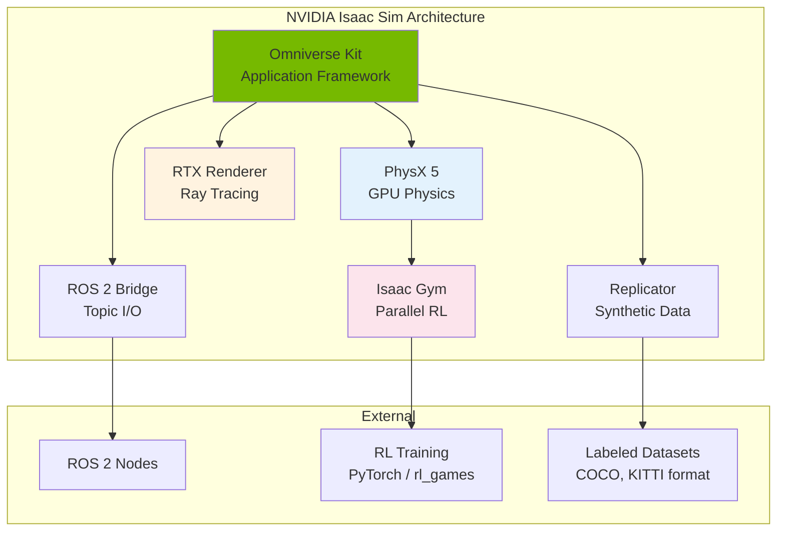
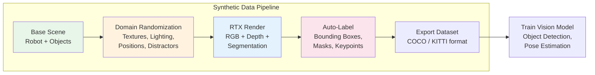
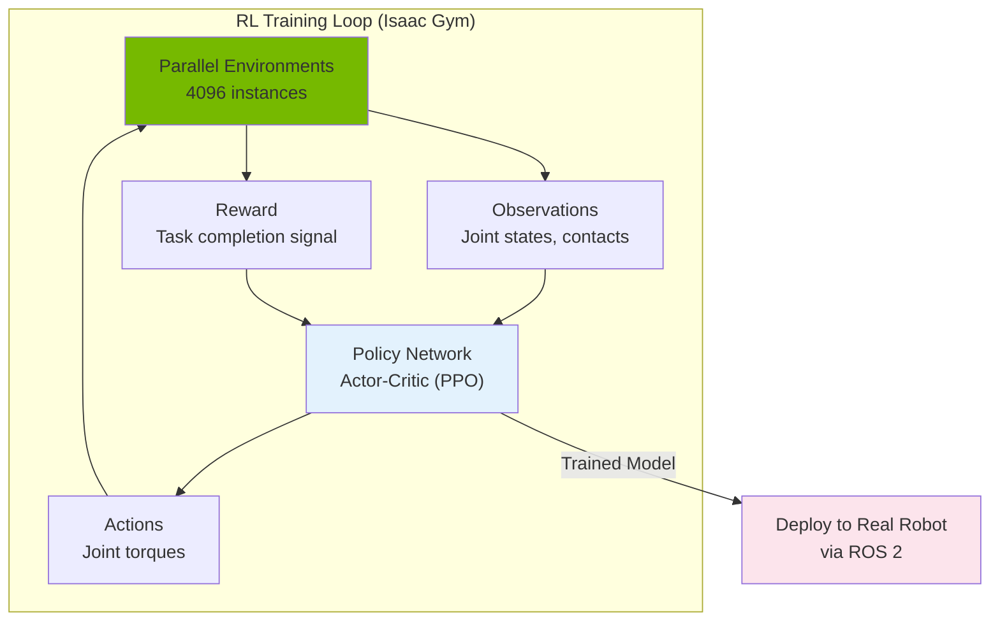

# Module 3: The AI-Robot Brain (NVIDIA Isaac)

## Learning Objectives

After completing this module, you will be able to:

- **Explain** the NVIDIA Isaac Sim architecture and its role in the Omniverse platform
- **Install and run** Isaac Sim using Docker containers
- **Load and simulate** robot models (URDF) in Isaac Sim using the Python scripting API
- **Connect Isaac Sim to ROS 2** using the built-in ROS 2 bridge
- **Generate synthetic training data** with domain randomization and automatic labeling
- **Train reinforcement learning policies** using Isaac Gym for locomotion tasks
- **Evaluate hardware requirements** and choose appropriate setup paths (local, Docker, cloud)

**Estimated completion time**: 8–10 hours

**Prerequisites**: [Module 1 — ROS 2](./module1-ros2), [Module 2 — Gazebo & Unity](./module2-gazebo-unity)

---

## Theory

### NVIDIA Isaac Sim Overview

**NVIDIA Isaac Sim** is a GPU-accelerated robotics simulator built on the **NVIDIA Omniverse** platform. While Gazebo provides accurate physics and Unity offers photorealistic rendering, Isaac Sim combines both — high-fidelity physics simulation with ray-traced rendering — and adds GPU-parallelized reinforcement learning through **Isaac Gym**.

**Omniverse Platform:**

Isaac Sim runs on top of Omniverse Kit, NVIDIA's framework for building 3D simulation applications. The platform uses **Universal Scene Description (USD)** as its native file format. USD, originally developed by Pixar for film production, provides a hierarchical, composable scene representation that supports:

- **Non-destructive layering**: Multiple users can edit different aspects of the same scene simultaneously
- **Referencing**: A robot model defined once can be placed in many scenes without duplication
- **Variants**: Switch between different configurations (e.g., gripper types) without separate files

**Core Components:**

| Component | Role |
|-----------|------|
| **Omniverse Kit** | Application framework and viewport rendering |
| **PhysX 5** | GPU-accelerated physics engine (rigid body, soft body, fluids) |
| **RTX Renderer** | Real-time ray tracing for photorealistic images |
| **Replicator** | Synthetic data generation with domain randomization |
| **ROS 2 Bridge** | Native publish/subscribe connection to ROS 2 |
| **Isaac Gym** | Massively parallel RL training (thousands of envs on one GPU) |



*Figure: Isaac Sim architecture. Omniverse Kit provides the framework. PhysX handles physics, RTX handles rendering, and specialized modules handle ROS 2, synthetic data, and RL training.*

**Why Isaac Sim over Gazebo?**

Isaac Sim's key advantage is **scale**. Isaac Gym can run 4,096 parallel robot instances on a single GPU, generating years of simulation experience in hours. This makes reinforcement learning practical for complex behaviors (locomotion, dexterous manipulation) that require billions of timesteps. Gazebo runs one instance per process and cannot match this throughput.

:::note Licensing
Isaac Sim is **free for individual developers and educational use**. Commercial deployment requires an NVIDIA Omniverse Enterprise license. Students and researchers can download and use it without restrictions.
:::

---

### Isaac Sim for Robot Learning

Isaac Sim provides three pathways for training robot AI:

**1. Reinforcement Learning with Isaac Gym**

Isaac Gym is a high-performance RL framework that runs the physics simulation and the neural network policy on the **same GPU**, eliminating the CPU-GPU data transfer bottleneck that slows down other simulators.

The workflow:
1. Define a task: observations (joint positions, velocities, goals), actions (joint torques), reward function
2. Create thousands of parallel environment instances on one GPU
3. Step all environments simultaneously, collect observations, compute rewards
4. Update the policy network using PPO, SAC, or other algorithms
5. Repeat for millions of steps (takes hours, not weeks)

**2. Synthetic Data Generation with Replicator**

Training vision-based robots requires large labeled datasets. Real-world labeling is expensive and slow. Isaac Sim's Replicator module generates labeled training data automatically:

- **Domain randomization**: Randomly vary lighting, textures, object positions, camera angles, and distractors
- **Automatic annotations**: Bounding boxes, segmentation masks, depth maps, surface normals — all generated from the renderer with perfect accuracy
- **Standard formats**: Export to COCO, KITTI, or custom formats compatible with PyTorch/TensorFlow data loaders



*Figure: Synthetic data pipeline. Domain randomization creates diverse training scenes, RTX renders photorealistic images, and automatic labeling produces ready-to-use datasets.*

**3. Sim-to-Real Transfer**

Policies trained in Isaac Sim transfer to real robots using:
- **Domain randomization**: Train with varied physics parameters (friction, mass, damping) so the policy generalizes
- **System identification**: Measure real robot properties and configure simulation to match
- **Asymmetric actor-critic**: Give the critic privileged information (exact state) during training while the actor only sees sensor data it would have on the real robot



*Figure: Isaac Gym RL training loop. Thousands of environments run in parallel on one GPU. The trained policy deploys to the real robot through ROS 2.*

---

### Hardware Requirements & Alternatives

Isaac Sim is GPU-intensive. Here are the requirements and alternatives for students.

:::warning Hardware Requirements
Isaac Sim requires an **NVIDIA RTX 2070 or newer GPU** with **8 GB+ VRAM**. It does not run on AMD GPUs, Intel integrated graphics, or Apple Silicon. Check your GPU before attempting installation.
:::

**Minimum vs Recommended:**

| Spec | Minimum | Recommended | Ideal (RL Training) |
|------|---------|-------------|---------------------|
| **GPU** | RTX 2070 (8 GB) | RTX 3080 (10 GB) | RTX 4090 (24 GB) |
| **CPU** | Intel i7 / AMD Ryzen 7 | Intel i9 / AMD Ryzen 9 | 16+ cores |
| **RAM** | 32 GB | 64 GB | 64+ GB |
| **Storage** | 50 GB SSD | 100 GB NVMe | 500 GB NVMe |
| **OS** | Ubuntu 22.04 | Ubuntu 22.04 | Ubuntu 22.04 |

**Alternatives for Students Without RTX GPUs:**

:::tip Setup Alternatives
1. **Docker container** (recommended): Run Isaac Sim in a Docker container with GPU passthrough. Simplifies dependency management.
2. **NVIDIA NGC Cloud**: Access Isaac Sim through NVIDIA's cloud platform. Free tier available for evaluation.
3. **University GPU clusters**: Many universities provide shared GPU servers. Ask your IT department about NVIDIA GPU access.
4. **Google Colab Pro+**: Isaac Gym (not full Isaac Sim) can run on Colab's T4/A100 GPUs for RL training.
5. **Exercises without GPU**: Exercise 1 in this module can be completed using only the Isaac Sim Python API documentation and USD file creation (no rendering required).
:::

---

## Tutorials

### Tutorial 1: Installing Isaac Sim via Docker

**Goal**: Pull and run the Isaac Sim Docker container with GPU access.

**Prerequisites**: Ubuntu 22.04, NVIDIA GPU with latest drivers, Docker installed

**Step 1** — Verify your GPU and driver:

```bash
# Check GPU model and driver version:
nvidia-smi
```

Expected output (example):

```text
+-----------------------------------------------------------------------------+
| NVIDIA-SMI 535.129.03   Driver Version: 535.129.03   CUDA Version: 12.2     |
|-------------------------------+----------------------+----------------------+
| GPU  Name        Persistence-M| Bus-Id        Disp.A | Volatile Uncorr. ECC |
| Fan  Temp  Perf  Pwr:Usage/Cap|         Memory-Usage | GPU-Util  Compute M. |
|   0  NVIDIA GeForce RTX 3080  |   00000000:01:00.0  On |                  N/A |
| 30%   40C    P8    20W / 320W |    512MiB / 10240MiB |      0%      Default |
+-------------------------------+----------------------+----------------------+
```

Verify: Driver version >= 525.60 and GPU is RTX 2070 or newer.

**Step 2** — Install NVIDIA Container Toolkit:

```bash
# Add NVIDIA container toolkit repo:
distribution=$(. /etc/os-release;echo $ID$VERSION_ID)
curl -fsSL https://nvidia.github.io/libnvidia-container/gpgkey \
  | sudo gpg --dearmor -o /usr/share/keyrings/nvidia-container-toolkit-keyring.gpg

curl -s -L "https://nvidia.github.io/libnvidia-container/$distribution/libnvidia-container.list" \
  | sed 's#deb https://#deb [signed-by=/usr/share/keyrings/nvidia-container-toolkit-keyring.gpg] https://#g' \
  | sudo tee /etc/apt/sources.list.d/nvidia-container-toolkit.list

sudo apt update
sudo apt install -y nvidia-container-toolkit
sudo nvidia-ctk runtime configure --runtime=docker
sudo systemctl restart docker
```

**Step 3** — Pull the Isaac Sim container:

```bash
# Login to NVIDIA NGC (create free account at ngc.nvidia.com):
docker login nvcr.io

# Pull Isaac Sim container:
docker pull nvcr.io/nvidia/isaac-sim:4.2.0
```

**Step 4** — Run Isaac Sim:

```bash
# Run with GUI (requires display):
docker run --name isaac-sim --entrypoint bash -it --gpus all \
  -e "ACCEPT_EULA=Y" \
  -e "DISPLAY=$DISPLAY" \
  -v /tmp/.X11-unix:/tmp/.X11-unix \
  -v ~/isaac-sim-data:/root/Documents \
  --network=host \
  nvcr.io/nvidia/isaac-sim:4.2.0
```

Inside the container, start Isaac Sim:

```bash
./runheadless.native.sh
# Or with GUI:
./runapp.sh
```

**Step 5** — Verify the installation:

```bash
# Inside the container, run a basic test:
./python.sh -c "
from omni.isaac.core import World
world = World()
print('Isaac Sim initialized successfully!')
print(f'Physics dt: {world.get_physics_dt()}')
"
```

Expected output:

```text
Isaac Sim initialized successfully!
Physics dt: 0.016666666666666666
```

---

### Tutorial 2: Loading a Robot in Isaac Sim

**Goal**: Use the Python scripting API to load a URDF robot, position it, and run the simulation.

**Step 1** — Create a Python script `load_robot.py`:

```python
"""Load a robot from URDF into Isaac Sim and run simulation."""

from omni.isaac.kit import SimulationApp

# Initialize Isaac Sim (headless mode for scripting)
simulation_app = SimulationApp({"headless": True})

from omni.isaac.core import World
from omni.isaac.core.utils.stage import add_reference_to_stage
from omni.isaac.core.robots import Robot
from omni.isaac.core.utils.types import ArticulationAction
import numpy as np

# Create simulation world
world = World(stage_units_in_meters=1.0)
world.scene.add_default_ground_plane()

# Load a robot from URDF
# Isaac Sim includes several built-in robot models:
robot_usd_path = "/Isaac/Robots/Franka/franka_alt_fingers.usd"
add_reference_to_stage(
    usd_path=robot_usd_path,
    prim_path="/World/Franka"
)

# Wrap as an articulation for control
robot = world.scene.add(
    Robot(
        prim_path="/World/Franka",
        name="franka_robot",
        position=np.array([0.0, 0.0, 0.0]),
    )
)

# Reset the world (initializes physics)
world.reset()

# Print robot info
num_dof = robot.num_dof
print(f"Robot loaded: {robot.name}")
print(f"Degrees of freedom: {num_dof}")
print(f"Joint names: {robot.dof_names}")
print(f"Joint positions: {robot.get_joint_positions()}")

# Run simulation for 100 steps
for step in range(100):
    # Send joint position targets (move to home position)
    target_positions = np.zeros(num_dof)
    target_positions[0] = 0.0     # Joint 1
    target_positions[1] = -0.785  # Joint 2 (-45 degrees)
    target_positions[2] = 0.0     # Joint 3
    target_positions[3] = -2.356  # Joint 4 (-135 degrees)
    target_positions[4] = 0.0     # Joint 5
    target_positions[5] = 1.571   # Joint 6 (90 degrees)
    target_positions[6] = 0.785   # Joint 7 (45 degrees)

    action = ArticulationAction(joint_positions=target_positions)
    robot.apply_action(action)
    world.step(render=False)

    if step % 25 == 0:
        current_pos = robot.get_joint_positions()
        print(f"Step {step}: joints = {np.round(current_pos, 3)}")

print("Simulation complete!")
simulation_app.close()
```

**Step 2** — Run the script inside the Isaac Sim container:

```bash
./python.sh load_robot.py
```

Expected output:

```text
Robot loaded: franka_robot
Degrees of freedom: 9
Joint names: ['panda_joint1', 'panda_joint2', ..., 'panda_finger_joint2']
Joint positions: [0. 0. 0. 0. 0. 0. 0. 0.04 0.04]
Step 0: joints = [ 0.     0.     0.     0.     0.     0.     0.     0.04   0.04 ]
Step 25: joints = [ 0.    -0.392  0.    -1.178  0.     0.786  0.393  0.04   0.04 ]
Step 50: joints = [ 0.    -0.654  0.    -1.964  0.     1.309  0.654  0.04   0.04 ]
Step 75: joints = [ 0.    -0.762  0.    -2.291  0.     1.527  0.762  0.04   0.04 ]
Simulation complete!
```

:::caution GPU Memory
Each Isaac Sim instance uses 2-4 GB of GPU memory at minimum. Loading complex scenes with ray tracing enabled can use 8+ GB. Monitor memory with `nvidia-smi` and close other GPU applications before running Isaac Sim.
:::

---

### Tutorial 3: Connecting Isaac Sim to ROS 2

**Goal**: Enable the ROS 2 bridge in Isaac Sim and exchange messages with external ROS 2 nodes.

**Step 1** — Create a script that publishes joint states to ROS 2. Create `isaac_ros2_bridge.py`:

```python
"""Connect Isaac Sim to ROS 2 and publish joint states."""

from omni.isaac.kit import SimulationApp

simulation_app = SimulationApp({"headless": True})

from omni.isaac.core import World
from omni.isaac.core.utils.stage import add_reference_to_stage
from omni.isaac.core.robots import Robot
from omni.isaac.core.utils.extensions import enable_extension
import numpy as np

# Enable the ROS 2 bridge extension
enable_extension("omni.isaac.ros2_bridge")

world = World(stage_units_in_meters=1.0)
world.scene.add_default_ground_plane()

# Load robot
add_reference_to_stage(
    usd_path="/Isaac/Robots/Franka/franka_alt_fingers.usd",
    prim_path="/World/Franka"
)

robot = world.scene.add(
    Robot(prim_path="/World/Franka", name="franka_robot")
)

world.reset()

# The ROS 2 bridge automatically publishes:
# - /joint_states (sensor_msgs/JointState)
# - /tf (tf2_msgs/TFMessage)
# when configured through the USD stage

print("Isaac Sim ROS 2 bridge active.")
print("In another terminal, run:")
print("  ros2 topic list")
print("  ros2 topic echo /joint_states")

# Run simulation loop
step = 0
while simulation_app.is_running():
    world.step(render=False)
    step += 1

    if step % 500 == 0:
        pos = robot.get_joint_positions()
        print(f"Step {step}: Publishing joint states to ROS 2")

    if step > 5000:
        break

simulation_app.close()
```

**Step 2** — Run the script and verify in ROS 2:

```bash
# Terminal 1 (inside Isaac Sim container):
./python.sh isaac_ros2_bridge.py

# Terminal 2 (host, with ROS 2 sourced):
source /opt/ros/humble/setup.bash
ros2 topic list
```

Expected output (Terminal 2):

```text
/joint_states
/tf
/tf_static
/clock
/parameter_events
/rosout
```

**Step 3** — Echo joint states:

```bash
ros2 topic echo /joint_states --once
```

Expected output:

```text
header:
  stamp:
    sec: 1
    nanosec: 500000000
  frame_id: ''
name:
- panda_joint1
- panda_joint2
- panda_joint3
...
position:
- 0.0
- -0.785
- 0.0
...
```

---

### Tutorial 4: Generating Synthetic Training Data

**Goal**: Use Isaac Sim Replicator to generate a labeled dataset with domain randomization.

**Step 1** — Create a synthetic data generation script `generate_data.py`:

```python
"""Generate synthetic training data using Isaac Sim Replicator."""

from omni.isaac.kit import SimulationApp

simulation_app = SimulationApp({"headless": True})

import omni.replicator.core as rep
from omni.isaac.core import World

world = World()
world.scene.add_default_ground_plane()

# Create a table with objects for manipulation training
rep.create.cube(
    position=(0.5, 0.0, 0.5),
    scale=(0.6, 0.4, 0.02),
    semantics=[("class", "table")],
)

# Add randomized objects on the table
with rep.new_layer():
    cube = rep.create.cube(
        semantics=[("class", "cube")],
        count=3,
    )
    sphere = rep.create.sphere(
        semantics=[("class", "sphere")],
        count=2,
    )
    cylinder = rep.create.cylinder(
        semantics=[("class", "cylinder")],
        count=2,
    )

    # Define randomization per frame
    with rep.trigger.on_frame(num_frames=100):
        with cube:
            rep.modify.pose(
                position=rep.distribution.uniform(
                    (0.2, -0.2, 0.52), (0.8, 0.2, 0.52)
                ),
                rotation=rep.distribution.uniform(
                    (0, 0, 0), (0, 0, 360)
                ),
            )
            rep.modify.attribute(
                "primvars:displayColor",
                rep.distribution.choice([
                    [(1, 0, 0)], [(0, 1, 0)], [(0, 0, 1)],
                    [(1, 1, 0)], [(1, 0, 1)],
                ])
            )

        with sphere:
            rep.modify.pose(
                position=rep.distribution.uniform(
                    (0.2, -0.2, 0.55), (0.8, 0.2, 0.55)
                ),
            )

        with cylinder:
            rep.modify.pose(
                position=rep.distribution.uniform(
                    (0.2, -0.2, 0.53), (0.8, 0.2, 0.53)
                ),
            )

# Set up camera
camera = rep.create.camera(
    position=(1.5, 0.0, 1.2),
    look_at=(0.5, 0.0, 0.5),
)

# Configure output
render_product = rep.create.render_product(camera, (640, 480))

writer = rep.WriterRegistry.get("BasicWriter")
writer.initialize(
    output_dir="~/synthetic_data/output",
    rgb=True,
    bounding_box_2d_tight=True,
    semantic_segmentation=True,
    distance_to_camera=True,
)
writer.attach([render_product])

# Generate the dataset
rep.orchestrator.run()

print("Dataset generation complete!")
print("Output saved to: ~/synthetic_data/output/")
print("Contains: RGB images, bounding boxes, segmentation masks, depth maps")

simulation_app.close()
```

**Step 2** — Run the script:

```bash
./python.sh generate_data.py
```

Expected output:

```text
Generating frame 1/100...
...
Generating frame 100/100...
Dataset generation complete!
Output saved to: ~/synthetic_data/output/
```

**Step 3** — Inspect the generated data:

```bash
ls ~/synthetic_data/output/
```

Expected structure:

```text
rgb/                      # 100 RGB images (640x480 PNG)
bounding_box_2d_tight/    # JSON annotations per frame
semantic_segmentation/    # Segmentation mask images
distance_to_camera/       # Depth maps
```

---

### Tutorial 5: Reinforcement Learning with Isaac Gym

**Goal**: Train a locomotion policy for a quadruped robot using Isaac Gym's parallel simulation.

**Step 1** — Install Isaac Gym (standalone, lighter than full Isaac Sim):

```bash
# Download Isaac Gym from NVIDIA developer portal
# (requires free NVIDIA developer account)

# Extract and install:
cd isaacgym
pip install -e python/

# Verify installation:
python -c "import isaacgym; print('Isaac Gym installed!')"
```

**Step 2** — Clone the Isaac Gym benchmark environments:

```bash
git clone https://github.com/NVIDIA-Omniverse/IsaacGymEnvs.git
cd IsaacGymEnvs
pip install -e .
```

**Step 3** — Train a quadruped locomotion policy:

```bash
# Train the Ant (quadruped) locomotion task:
python train.py task=Ant num_envs=2048
```

Expected training output:

```text
[INFO] Policy: MLP [256, 128, 64]
[INFO] Number of environments: 2048
[INFO] Starting training...
Epoch 1/500 | Reward: 450.2 | FPS: 85000
Epoch 50/500 | Reward: 2100.5 | FPS: 92000
Epoch 100/500 | Reward: 4500.8 | FPS: 90000
Epoch 200/500 | Reward: 6200.3 | FPS: 88000
Epoch 500/500 | Reward: 7800.1 | FPS: 87000
Training complete! Model saved to: runs/Ant/nn/Ant.pth
```

**Step 4** — Visualize the trained policy:

```bash
# Play the trained policy with rendering:
python train.py task=Ant num_envs=64 test=True \
  checkpoint=runs/Ant/nn/Ant.pth
```

A window opens showing 64 ants walking forward using the learned policy.

**Step 5** — Create a custom RL task. Create `custom_task.py`:

```python
"""Custom Isaac Gym task: balance a pole on a cart."""

import torch
from isaacgym import gymapi, gymtorch
import numpy as np


class CartPoleTask:
    """Cart-pole balancing task for Isaac Gym."""

    def __init__(self, num_envs=1024):
        self.num_envs = num_envs
        self.gym = gymapi.acquire_gym()

        # Simulation parameters
        sim_params = gymapi.SimParams()
        sim_params.dt = 1.0 / 60.0
        sim_params.substeps = 2
        sim_params.physx.solver_type = 1
        sim_params.physx.num_position_iterations = 4
        sim_params.physx.num_velocity_iterations = 1
        sim_params.use_gpu_pipeline = True

        self.sim = self.gym.create_sim(
            0, 0, gymapi.SIM_PHYSX, sim_params
        )

        # Create ground plane
        plane_params = gymapi.PlaneParams()
        self.gym.add_ground(self.sim, plane_params)

        self._create_envs()

        # Observation: cart_pos, cart_vel, pole_angle, pole_vel
        self.obs_dim = 4
        # Action: force on cart (-1 to 1)
        self.act_dim = 1

    def _create_envs(self):
        """Create parallel cart-pole environments."""
        asset_options = gymapi.AssetOptions()
        asset = self.gym.load_asset(
            self.sim, "assets", "cartpole.urdf", asset_options
        )

        env_spacing = 2.0
        self.envs = []

        for i in range(self.num_envs):
            env = self.gym.create_env(
                self.sim,
                gymapi.Vec3(-env_spacing, -env_spacing, 0),
                gymapi.Vec3(env_spacing, env_spacing, env_spacing),
                int(np.sqrt(self.num_envs)),
            )

            pose = gymapi.Transform()
            pose.p = gymapi.Vec3(0, 0, 1.0)
            self.gym.create_actor(env, asset, pose, "cartpole", i, 1)
            self.envs.append(env)

    def compute_reward(self, obs):
        """Reward: +1 for pole upright, penalty for falling."""
        pole_angle = obs[:, 2]
        cart_pos = obs[:, 0]

        upright_reward = 1.0 - torch.abs(pole_angle) / 0.5
        position_penalty = -0.1 * torch.abs(cart_pos)
        reward = upright_reward + position_penalty

        # Episode done if pole falls > 30 degrees
        done = torch.abs(pole_angle) > 0.5
        return reward, done
```

:::caution GPU Memory for RL Training
Each parallel environment uses GPU memory. Rough guidelines:
- **1024 envs**: ~2 GB VRAM (RTX 2070 minimum)
- **4096 envs**: ~6 GB VRAM (RTX 3080 recommended)
- **8192 envs**: ~12 GB VRAM (RTX 4090 or A100)

Start with fewer environments and increase until you approach your GPU memory limit.
:::

---

## Common Errors & Troubleshooting

### 1. CUDA Driver Mismatch

**Symptom**: `CUDA driver version is insufficient for CUDA runtime version`.

**Cause**: NVIDIA driver is too old for the CUDA version bundled with Isaac Sim.

**Fix**:

```bash
# Check current driver version:
nvidia-smi

# Update NVIDIA driver:
sudo apt update
sudo apt install -y nvidia-driver-535

# Reboot required:
sudo reboot
```

**Prevention**: Isaac Sim 4.x requires driver >= 525.60.

---

### 2. Docker GPU Passthrough Fails

**Symptom**: `could not select device driver "" with capabilities: [[gpu]]`.

**Cause**: NVIDIA Container Toolkit not installed or Docker not configured.

**Fix**:

```bash
sudo apt install -y nvidia-container-toolkit
sudo nvidia-ctk runtime configure --runtime=docker
sudo systemctl restart docker

# Verify:
docker run --rm --gpus all nvidia/cuda:12.2.0-base-ubuntu22.04 nvidia-smi
```

---

### 3. Isaac Sim Crashes on Startup

**Symptom**: Window opens briefly then closes, or `Segmentation fault`.

**Cause**: Insufficient GPU memory, corrupted cache, or missing Vulkan libraries.

**Fix**:

```bash
# Clear cache:
rm -rf ~/.nvidia-omniverse/cache/*

# Install Vulkan:
sudo apt install -y libvulkan1 vulkan-tools

# Try headless mode:
./runheadless.native.sh
```

---

### 4. ROS 2 Bridge Shows No Connection

**Symptom**: `ros2 topic list` shows no Isaac Sim topics.

**Cause**: Bridge extension not enabled or DDS domain ID mismatch.

**Fix**:

```bash
# Ensure same ROS_DOMAIN_ID:
export ROS_DOMAIN_ID=0  # Both in container and host

# Use --network=host in Docker:
docker run --network=host --gpus all ...

# Enable bridge in Python script:
# enable_extension("omni.isaac.ros2_bridge")
```

---

### 5. USD File Loading Errors

**Symptom**: `Cannot open USD file` or `Invalid USD path`.

**Cause**: Using filesystem paths instead of Nucleus server paths.

**Fix**:

```python
# Use the nucleus path helper:
from omni.isaac.core.utils.nucleus import get_assets_root_path

assets_root = get_assets_root_path()
robot_path = f"{assets_root}/Isaac/Robots/Franka/franka_alt_fingers.usd"

# For local URDF files, use the URDF importer:
from omni.isaac.urdf import _urdf
urdf_interface = _urdf.acquire_urdf_interface()
import_config = _urdf.ImportConfig()
result = urdf_interface.parse_urdf(
    "/path/to/your/robot.urdf", import_config
)
```

---

## Exercises

### Exercise 1: Custom Environment Setup

**Objective**: Create an Isaac Sim scene with a table, manipulation objects, and a robot arm.

**Requirements**:

1. Create a Python script that builds a scene containing:
   - A ground plane
   - A table (1.2m x 0.8m x 0.75m) at position (0.5, 0, 0)
   - 5 objects on the table: 2 cubes (red, blue), 2 cylinders (green, yellow), 1 sphere (white)
   - A Franka Panda robot arm positioned at the table edge
   - A camera mounted above the table looking down at 45 degrees

2. The script should:
   - Load the scene and print position of each object
   - Move the robot to a home position
   - Capture one RGB image from the camera

**Success criteria**: Scene loads without errors. Robot reaches home position. Camera captures an image showing all objects.

**Note**: This exercise can be completed by writing the Python code and reviewing the [Isaac Sim API documentation](https://docs.omniverse.nvidia.com/isaacsim/latest/), even without a local GPU.

---

### Exercise 2: Synthetic Dataset Generator

**Objective**: Generate 100 labeled images of manipulation objects using domain randomization.

**Requirements**:

1. Extend the Replicator script from Tutorial 4 to:
   - Use 5 object categories (cube, sphere, cylinder, cone, torus)
   - Randomize colors from a set of 10 colors
   - Randomize lighting direction and intensity
   - Randomize camera position within a hemisphere above the scene
   - Add 3 random distractor objects per frame

2. Generate: 100 RGB images, COCO-format bounding boxes, semantic and instance segmentation masks

3. Write a validation script that loads 5 random images and verifies bounding boxes are within image bounds

**Success criteria**: 100 images with valid COCO annotations. At least 3 object classes per image.

---

### Exercise 3: RL-Trained Walker

**Objective**: Train a bipedal locomotion policy using Isaac Gym.

**Requirements**:

1. Train the Humanoid task: `python train.py task=Humanoid num_envs=2048`
2. Record mean reward curve, final reward, training FPS, and wall-clock time
3. Compare training with 512, 2048, and 4096 parallel environments
4. Write a 200-300 word report analyzing how environment count affects speed and quality

**Success criteria**: Humanoid walks forward after training. Mean reward exceeds 3000. Report includes FPS comparison.

---

## Official Documentation & Resources

**Estimated module completion time**: 8–10 hours

**Hardware requirements matrix:**

| Task | GPU | VRAM | Can Use Colab? |
|------|-----|------|---------------|
| Isaac Sim (full) | RTX 2070+ | 8 GB+ | No |
| Isaac Gym (RL) | GTX 1060+ | 4 GB+ | Yes (T4/A100) |
| Replicator (data gen) | RTX 2070+ | 8 GB+ | No |
| USD scripting (no render) | Any | 2 GB+ | Yes |

### NVIDIA Isaac

- [Isaac Sim Documentation](https://docs.omniverse.nvidia.com/isaacsim/latest/) — Official guides, API reference, tutorials
- [Isaac Sim Python API](https://docs.omniverse.nvidia.com/py/isaacsim/) — Complete Python scripting reference
- [Isaac Gym Documentation](https://developer.nvidia.com/isaac-gym) — RL framework docs and examples
- [IsaacGymEnvs](https://github.com/NVIDIA-Omniverse/IsaacGymEnvs) — Benchmark RL environments

### NVIDIA Omniverse

- [Omniverse Documentation](https://docs.omniverse.nvidia.com/) — Platform overview
- [USD Documentation](https://openusd.org/release/index.html) — Universal Scene Description spec
- [NVIDIA NGC Catalog](https://catalog.ngc.nvidia.com/) — Container images and pre-trained models

### Research Papers

- [Isaac Gym: High Performance GPU-Based Physics Simulation](https://arxiv.org/abs/2108.10470)
- [Learning Agile Locomotion via Adversarial Training](https://arxiv.org/abs/2104.09508)
- [Structured Domain Randomization](https://arxiv.org/abs/1810.10093)

---

**Next**: [Module 4 — Vision-Language-Action (VLA)](./module4-vla) teaches you to build AI systems that understand natural language commands and translate them into robot actions.
