# Module 4: Vision-Language-Action (VLA)

## Learning Objectives

After completing this module, you will be able to:

- **Trace the evolution** from language models (LLMs) to vision-language models (VLMs) to vision-language-action models (VLAs)
- **Explain the VLA architecture**: vision encoder, language encoder, action decoder, and action tokenization
- **Compare open-source VLA models** (Octo, OpenVLA) in terms of capabilities and hardware requirements
- **Run inference** with a pretrained VLA model on robot manipulation tasks
- **Build a ROS 2 VLA bridge node** that connects camera input to robot action output
- **Fine-tune** a VLA model on custom robot data
- **Evaluate VLA performance** in simulation against classical planning baselines

**Estimated completion time**: 8–10 hours

**Prerequisites**: [Module 1 — ROS 2](./module1-ros2) (for the bridge node), [Module 3 — Isaac](./module3-isaac) (for simulation evaluation)

---

## Theory

### From Language Models to Robot Actions

The journey from text-generating AI to robot-controlling AI follows a clear progression:

**Stage 1: Large Language Models (LLMs)**
Models like GPT and LLaMA learn to predict the next token in a text sequence. They understand language, reason about concepts, and follow instructions — but they have no connection to the physical world. They cannot see, move, or interact with objects.

**Stage 2: Vision-Language Models (VLMs)**
Models like CLIP, LLaVA, and GPT-4V add a vision encoder alongside the language model. They can now process images and answer questions about them ("What objects are on the table?"). However, they still only produce text — they cannot generate physical actions.

**Stage 3: Vision-Language-Action Models (VLAs)**
VLAs add an **action decoder** that translates the model's understanding of vision and language into robot commands. Given a camera image and a natural language instruction ("Pick up the red cup"), a VLA outputs specific motor commands (joint positions, gripper force) to execute that instruction.

**Key research milestones:**

| Model | Year | Key Contribution |
|-------|------|-----------------|
| **CLIPort** | 2021 | Combined CLIP with transporter networks for manipulation |
| **RT-1** | 2022 | Google's first large-scale robot transformer (130K real demos) |
| **PaLM-E** | 2023 | 562B parameter embodied multimodal model |
| **RT-2** | 2023 | VLM directly outputs robot actions as text tokens |
| **Octo** | 2024 | Open-source generalist robot policy (800K trajectories) |
| **OpenVLA** | 2024 | Open-source 7B VLA built on Llama 2 + DINOv2 |

The critical insight behind VLAs is **action tokenization**: robot actions (7-DOF joint positions, gripper state) are converted into tokens that the language model's transformer architecture can predict, just like it predicts the next word in a sentence.

```mermaid
graph LR
    subgraph "Evolution of AI Models"
        LLM["LLM<br/>Text → Text"] --> VLM["VLM<br/>Image + Text → Text"]
        VLM --> VLA["VLA<br/>Image + Text → Robot Actions"]
    end

    subgraph "VLA Inputs & Outputs"
        IMG["Camera Image 📷"] --> VLA2["VLA Model"]
        LANG["Language Instruction 💬<br/>'Pick up the red cup'"] --> VLA2
        VLA2 --> ACT["Robot Action 🤖<br/>Joint positions + Gripper"]
    end

    style LLM fill:#e3f2fd
    style VLM fill:#fff3e0
    style VLA fill:#e8f5e9
    style VLA2 fill:#e8f5e9
```



*Figure: Evolution from LLMs to VLAs. Each stage adds a new modality: LLMs process text, VLMs add vision, VLAs add physical actions.*

---

### VLA Architecture Explained

A VLA model consists of three main components connected by a transformer backbone:

**1. Vision Encoder**

Converts raw camera images into a sequence of visual tokens. Common choices:
- **DINOv2**: Self-supervised vision transformer. Produces rich spatial features without requiring labeled data. Used by OpenVLA.
- **SigLIP**: Contrastive vision-language model (successor to CLIP). Aligns visual features with language. Used by RT-2.
- **ResNet**: Convolutional network. Simpler, faster, but less expressive. Used by RT-1.

The vision encoder processes a 256x256 image into ~256 visual tokens, each representing a spatial patch of the image.

**2. Language Encoder**

Processes the natural language instruction into a sequence of language tokens. VLAs typically use the tokenizer and embedding layers from a pretrained LLM:
- **Llama 2** (OpenVLA): 32K vocabulary, strong instruction-following
- **PaLM** (RT-2): Google's proprietary LLM
- **T5** (Octo): Encoder-decoder architecture

**3. Action Decoder**

The critical innovation. The action decoder predicts robot actions in one of two ways:

- **Action tokenization** (RT-2, OpenVLA): Discretize the continuous action space into 256 bins per dimension. A 7-DOF action becomes 7 tokens, predicted autoregressively like words.
- **Continuous regression** (Octo): Output a continuous action vector using a diffusion head or MLP head. More precise but harder to train.

```mermaid
graph TD
    subgraph "VLA Architecture"
        IMG["Camera Image<br/>256 × 256 RGB"] --> VE["Vision Encoder<br/>DINOv2 / SigLIP"]
        VE --> VT["Visual Tokens<br/>256 tokens"]

        INST["Language Instruction<br/>'Pick up red cup'"] --> LE["Language Tokenizer<br/>Llama 2 / T5"]
        LE --> LT["Language Tokens<br/>~10 tokens"]

        VT --> TF["Transformer Backbone<br/>7B parameters"]
        LT --> TF

        TF --> AD["Action Decoder<br/>Tokenized or Continuous"]
        AD --> ACT["Robot Action<br/>[x, y, z, rx, ry, rz, grip]"]
    end

    style VE fill:#e3f2fd
    style LE fill:#fff3e0
    style TF fill:#f3e5f5
    style AD fill:#e8f5e9
```



*Figure: VLA architecture. Vision and language inputs are encoded into tokens, processed by a transformer, and decoded into robot actions.*

**Action space:**

A typical robot arm action is a 7-dimensional vector:

| Dimension | Meaning | Range |
|-----------|---------|-------|
| x, y, z | End-effector position delta | ±0.05m per step |
| rx, ry, rz | End-effector rotation delta | ±15° per step |
| gripper | Gripper open/close | 0.0 (open) to 1.0 (closed) |

---

### Open-Source VLA Models

Two open-source VLA models are accessible for students and researchers:

**Octo**

Octo is a generalist robot policy trained on 800K trajectories from the Open X-Embodiment dataset (25 robot platforms). It uses a transformer architecture with a diffusion action head.

- **Architecture**: ViT vision encoder + T5 language encoder + diffusion action head
- **Training data**: 800K trajectories from 25 robots
- **Strengths**: Generalizes across robot platforms, supports language and goal-image conditioning
- **GPU requirement**: 8-12 GB VRAM for inference
- **License**: MIT (fully open)

**OpenVLA**

OpenVLA is a 7B parameter VLA built on Llama 2 and DINOv2. It uses action tokenization (like RT-2) to predict discretized actions autoregressively.

- **Architecture**: DINOv2 vision encoder + Llama 2 7B language backbone + tokenized action head
- **Training data**: Open X-Embodiment dataset
- **Strengths**: Leverages LLM reasoning, strong language-conditioned manipulation
- **GPU requirement**: 16-24 GB VRAM (7B parameters); 8 GB with 4-bit quantization
- **License**: MIT

**Comparison:**

| Feature | Octo | OpenVLA |
|---------|------|---------|
| **Parameters** | ~93M | ~7B |
| **Action head** | Diffusion | Tokenized (autoregressive) |
| **Inference speed** | ~5 Hz | ~2 Hz (fp16), ~1 Hz (fp32) |
| **Min GPU** | 8 GB | 16 GB (8 GB with quantization) |
| **Language support** | Yes | Yes (stronger) |
| **Fine-tuning** | Fast (~1 hour on A100) | Slower (~4 hours on A100) |


*Figure: VLA training pipeline. Start with a pretrained generalist model, fine-tune on your robot's data, and deploy as a ROS 2 node.*

:::warning GPU Memory Requirements
- **Octo inference**: 8-12 GB VRAM (fits on RTX 3080)
- **OpenVLA inference (fp16)**: 16 GB VRAM (RTX 4090 or A100)
- **OpenVLA inference (4-bit quantized)**: 8 GB VRAM (RTX 3080)
- **Fine-tuning**: 24+ GB VRAM (A100 40GB recommended)

Use 4-bit quantization via `bitsandbytes` to run OpenVLA on consumer GPUs.
:::

:::tip Google Colab for VLA Experiments
If you do not have a local GPU, use Google Colab Pro with an A100 GPU runtime. Colab provides 40 GB VRAM, enough for OpenVLA inference and Octo fine-tuning. Upload your data to Google Drive for persistence.
:::

---

### ROS 2 Integration Pattern


*Figure: ROS 2 VLA integration. The VLA bridge node subscribes to camera images and language commands, runs inference, and publishes robot actions.*

---

## Tutorials

### Tutorial 1: Setting Up a VLA Environment

**Goal**: Install dependencies and download a pretrained VLA model.

**Step 1** — Create a Python environment:

```bash
# Create virtual environment:
python3 -m venv ~/vla_env
source ~/vla_env/bin/activate

# Install PyTorch with CUDA support:
pip install torch torchvision --index-url https://download.pytorch.org/whl/cu121

# Install Hugging Face Transformers:
pip install transformers accelerate

# Install Octo:
pip install octo-model

# For OpenVLA (optional, needs more VRAM):
pip install bitsandbytes  # For 4-bit quantization
```

**Step 2** — Download and verify the Octo model:

```python
"""Verify Octo model installation."""

from octo.model.octo_model import OctoModel

# Download pretrained model (first run downloads ~500MB)
model = OctoModel.load_pretrained("hf://rail-berkeley/octo-small")

print(f"Model loaded: octo-small")
print(f"Observation space: {model.observation_space}")
print(f"Action space: {model.action_space}")
print(f"Language conditioned: {model.language_conditioned}")
```

Expected output:

```text
Model loaded: octo-small
Observation space: {'image_primary': (256, 256, 3)}
Action space: (7,)
Language conditioned: True
```

**Step 3** — Verify GPU availability:

```bash
python -c "
import torch
print(f'CUDA available: {torch.cuda.is_available()}')
print(f'GPU: {torch.cuda.get_device_name(0)}')
print(f'VRAM: {torch.cuda.get_device_properties(0).total_mem / 1e9:.1f} GB')
"
```

---

### Tutorial 2: Running Inference with Octo

**Goal**: Load a pretrained Octo model and predict robot actions from an observation.

**Step 1** — Create `octo_inference.py`:

```python
"""Run inference with the pretrained Octo model."""

import numpy as np
import jax
from octo.model.octo_model import OctoModel

# Load pretrained model
model = OctoModel.load_pretrained("hf://rail-berkeley/octo-small")
print("Model loaded.")

# Create a simulated observation
# In practice, this comes from a real camera
image = np.random.randint(0, 255, (256, 256, 3), dtype=np.uint8)

# Create the observation dictionary
observation = {
    "image_primary": image[np.newaxis, np.newaxis, ...],  # (1, 1, 256, 256, 3)
    "timestep_pad_mask": np.array([[True]]),
}

# Define the task via language
task = model.create_tasks(texts=["Pick up the red block"])

# Run inference
actions = model.sample_actions(
    observation,
    task,
    rng=jax.random.PRNGKey(0),
)

# actions shape: (1, action_horizon, action_dim)
action = actions[0, 0]  # First timestep
print(f"Predicted action (7-DOF):")
print(f"  Position delta: x={action[0]:.4f}, y={action[1]:.4f}, z={action[2]:.4f}")
print(f"  Rotation delta: rx={action[3]:.4f}, ry={action[4]:.4f}, rz={action[5]:.4f}")
print(f"  Gripper: {action[6]:.4f} ({'closing' if action[6] > 0 else 'opening'})")
```

Expected output:

```text
Model loaded.
Predicted action (7-DOF):
  Position delta: x=0.0023, y=-0.0015, z=0.0089
  Rotation delta: rx=0.0012, ry=-0.0034, rz=0.0056
  Gripper: 0.8234 (closing)
```

---

### Tutorial 3: Building a ROS 2 VLA Bridge Node

**Goal**: Create a ROS 2 node that subscribes to camera images, runs VLA inference, and publishes robot actions.

**Step 1** — Create a ROS 2 package:

```bash
cd ~/ros2_ws/src
ros2 pkg create --build-type ament_python vla_bridge
```

**Step 2** — Create `vla_bridge/vla_bridge/vla_node.py`:

```python
"""ROS 2 node that runs VLA inference on camera images."""

import rclpy
from rclpy.node import Node
from sensor_msgs.msg import Image
from std_msgs.msg import String, Float64MultiArray
import numpy as np
from cv_bridge import CvBridge

# Import VLA model (Octo)
from octo.model.octo_model import OctoModel
import jax


class VLABridgeNode(Node):
    """Subscribes to camera + language, publishes robot actions."""

    def __init__(self):
        super().__init__('vla_bridge')

        # Load VLA model
        self.get_logger().info('Loading VLA model (octo-small)...')
        self.model = OctoModel.load_pretrained(
            "hf://rail-berkeley/octo-small"
        )
        self.rng = jax.random.PRNGKey(0)
        self.get_logger().info('VLA model loaded.')

        # CV Bridge for image conversion
        self.bridge = CvBridge()

        # Current state
        self.current_image = None
        self.current_task = "Pick up the object"

        # Subscribers
        self.image_sub = self.create_subscription(
            Image, '/camera/image_raw', self.image_callback, 10
        )
        self.language_sub = self.create_subscription(
            String, '/language_command', self.language_callback, 10
        )

        # Publisher for robot actions
        self.action_pub = self.create_publisher(
            Float64MultiArray, '/robot_action', 10
        )

        # Inference timer (2 Hz — VLA inference is slow)
        self.timer = self.create_timer(0.5, self.inference_callback)

        self.get_logger().info('VLA bridge node ready.')

    def image_callback(self, msg: Image):
        """Store the latest camera image."""
        cv_image = self.bridge.imgmsg_to_cv2(msg, 'rgb8')
        # Resize to model input size
        from PIL import Image as PILImage
        pil_image = PILImage.fromarray(cv_image)
        pil_image = pil_image.resize((256, 256))
        self.current_image = np.array(pil_image)

    def language_callback(self, msg: String):
        """Update the language command."""
        self.current_task = msg.data
        self.get_logger().info(f'New task: {self.current_task}')

    def inference_callback(self):
        """Run VLA inference and publish action."""
        if self.current_image is None:
            return

        # Build observation
        observation = {
            "image_primary": self.current_image[
                np.newaxis, np.newaxis, ...
            ],
            "timestep_pad_mask": np.array([[True]]),
        }

        # Build task
        task = self.model.create_tasks(texts=[self.current_task])

        # Run inference
        self.rng, key = jax.random.split(self.rng)
        actions = self.model.sample_actions(observation, task, rng=key)
        action = actions[0, 0]  # (7,) array

        # Publish action
        msg = Float64MultiArray()
        msg.data = action.tolist()
        self.action_pub.publish(msg)

        self.get_logger().info(
            f'Action: pos=[{action[0]:.3f}, {action[1]:.3f}, {action[2]:.3f}] '
            f'grip={action[6]:.3f}'
        )


def main(args=None):
    rclpy.init(args=args)
    node = VLABridgeNode()
    try:
        rclpy.spin(node)
    except KeyboardInterrupt:
        pass
    finally:
        node.destroy_node()
        rclpy.shutdown()


if __name__ == '__main__':
    main()
```

**Step 3** — Test the node:

```bash
# Terminal 1: Start a camera (simulated or real):
ros2 run usb_cam usb_cam_node_exe  # Or use Gazebo camera

# Terminal 2: Start the VLA bridge:
source ~/vla_env/bin/activate
source ~/ros2_ws/install/setup.bash
ros2 run vla_bridge vla_node

# Terminal 3: Send a language command:
ros2 topic pub /language_command std_msgs/msg/String \
  "{data: 'Pick up the red block'}" --once

# Terminal 4: Monitor actions:
ros2 topic echo /robot_action
```

---

### Tutorial 4: Fine-Tuning a VLA Model on Custom Data

**Goal**: Fine-tune Octo on a custom manipulation dataset.

**Step 1** — Prepare your dataset in the RLDS format:

```python
"""Prepare a custom dataset for VLA fine-tuning."""

import tensorflow_datasets as tfds
import numpy as np


def create_episode(images, actions, language_instruction):
    """Create one episode in RLDS format."""
    steps = []
    for i in range(len(images)):
        step = {
            "observation": {
                "image_primary": images[i],  # (256, 256, 3) uint8
            },
            "action": actions[i],  # (7,) float32
            "language_instruction": language_instruction,
            "is_terminal": i == len(images) - 1,
        }
        steps.append(step)
    return steps


# Example: create 50 demo episodes
# In practice, collect these from teleoperation
episodes = []
for ep in range(50):
    num_steps = np.random.randint(20, 50)
    images = np.random.randint(
        0, 255, (num_steps, 256, 256, 3), dtype=np.uint8
    )
    actions = np.random.randn(num_steps, 7).astype(np.float32) * 0.01
    episodes.append(
        create_episode(images, actions, "Pick up the block")
    )

print(f"Created {len(episodes)} episodes")
print(f"Total steps: {sum(len(ep) for ep in episodes)}")
```

**Step 2** — Fine-tune the model:

```python
"""Fine-tune Octo on custom data."""

from octo.model.octo_model import OctoModel

# Load pretrained model
model = OctoModel.load_pretrained("hf://rail-berkeley/octo-small")

# Fine-tune configuration
config = {
    "learning_rate": 1e-4,
    "batch_size": 32,
    "num_steps": 5000,
    "warmup_steps": 500,
}

# Fine-tune (simplified — see Octo docs for full config)
# model.finetune(dataset=your_dataset, **config)

print("Fine-tuning complete!")
print("Save the model:")
# model.save_pretrained("./my_finetuned_octo")
```

---

### Tutorial 5: Evaluating VLA Performance in Simulation

**Goal**: Connect a VLA model to Gazebo or Isaac Sim and measure task success rate.

**Step 1** — Create an evaluation script `evaluate_vla.py`:

```python
"""Evaluate VLA task success rate in simulation."""

import rclpy
from rclpy.node import Node
from sensor_msgs.msg import Image
from std_msgs.msg import Float64MultiArray
from geometry_msgs.msg import Pose
import numpy as np
from cv_bridge import CvBridge


class VLAEvaluator(Node):
    """Runs VLA evaluation episodes in simulation."""

    def __init__(self, num_episodes=20):
        super().__init__('vla_evaluator')
        self.num_episodes = num_episodes
        self.bridge = CvBridge()

        # Track results
        self.successes = 0
        self.failures = 0
        self.current_episode = 0
        self.steps_in_episode = 0
        self.max_steps = 100  # Max steps per episode

        # Subscribe to object pose (ground truth from sim)
        self.object_sub = self.create_subscription(
            Pose, '/target_object/pose', self.object_callback, 10
        )

        # Subscribe to gripper pose
        self.gripper_sub = self.create_subscription(
            Pose, '/gripper/pose', self.gripper_callback, 10
        )

        self.object_pos = None
        self.gripper_pos = None

        self.timer = self.create_timer(0.5, self.evaluate_step)

    def object_callback(self, msg):
        self.object_pos = np.array([
            msg.position.x, msg.position.y, msg.position.z
        ])

    def gripper_callback(self, msg):
        self.gripper_pos = np.array([
            msg.position.x, msg.position.y, msg.position.z
        ])

    def evaluate_step(self):
        """Check task completion each step."""
        if self.current_episode >= self.num_episodes:
            self.report_results()
            return

        self.steps_in_episode += 1

        if self.object_pos is not None and self.gripper_pos is not None:
            distance = np.linalg.norm(self.object_pos - self.gripper_pos)

            if distance < 0.05:  # Object grasped
                self.successes += 1
                self.get_logger().info(
                    f'Episode {self.current_episode}: SUCCESS '
                    f'(step {self.steps_in_episode})'
                )
                self.reset_episode()

            elif self.steps_in_episode >= self.max_steps:
                self.failures += 1
                self.get_logger().warn(
                    f'Episode {self.current_episode}: FAIL (timeout)'
                )
                self.reset_episode()

    def reset_episode(self):
        """Reset for next episode."""
        self.current_episode += 1
        self.steps_in_episode = 0
        # In practice, call simulation reset service here

    def report_results(self):
        """Print final evaluation results."""
        total = self.successes + self.failures
        rate = self.successes / total * 100 if total > 0 else 0
        self.get_logger().info(f'=== Evaluation Complete ===')
        self.get_logger().info(f'Episodes: {total}')
        self.get_logger().info(f'Successes: {self.successes}')
        self.get_logger().info(f'Failures: {self.failures}')
        self.get_logger().info(f'Success rate: {rate:.1f}%')
        self.timer.cancel()


def main(args=None):
    rclpy.init(args=args)
    node = VLAEvaluator(num_episodes=20)
    try:
        rclpy.spin(node)
    except KeyboardInterrupt:
        pass
    finally:
        node.destroy_node()
        rclpy.shutdown()


if __name__ == '__main__':
    main()
```

---

## Common Errors & Troubleshooting

### 1. CUDA Out of Memory (OOM)

**Symptom**: `RuntimeError: CUDA out of memory` when loading or running the VLA model.

**Cause**: Model parameters exceed available GPU memory.

**Fix**:

```python
# Use 4-bit quantization for OpenVLA:
from transformers import AutoModelForCausalLM, BitsAndBytesConfig

quantization_config = BitsAndBytesConfig(
    load_in_4bit=True,
    bnb_4bit_compute_dtype="float16",
)
model = AutoModelForCausalLM.from_pretrained(
    "openvla/openvla-7b",
    quantization_config=quantization_config,
    device_map="auto",
)

# Or use the smaller Octo model instead:
# octo-small: ~400MB, fits on 8GB GPU
# octo-base: ~1.5GB, fits on 12GB GPU
```

---

### 2. Model Checkpoint Download Failure

**Symptom**: `ConnectionError` or `OSError` when loading from Hugging Face.

**Cause**: Network timeout, missing authentication, or model not found.

**Fix**:

```bash
# Login to Hugging Face:
pip install huggingface_hub
huggingface-cli login

# Download manually if auto-download fails:
huggingface-cli download rail-berkeley/octo-small --local-dir ./octo-small

# Then load from local path:
# model = OctoModel.load_pretrained("./octo-small")
```

---

### 3. Tokenizer Mismatch

**Symptom**: `ValueError: tokenizer produces unexpected token IDs` during OpenVLA inference.

**Cause**: Using a different tokenizer version than the model was trained with.

**Fix**:

```python
# Always load tokenizer from the same checkpoint:
from transformers import AutoTokenizer

tokenizer = AutoTokenizer.from_pretrained(
    "openvla/openvla-7b",
    revision="main",  # Pin to specific revision
)
```

---

### 4. cv_bridge Import Error

**Symptom**: `ModuleNotFoundError: No module named 'cv_bridge'` in the VLA bridge node.

**Cause**: `cv_bridge` is not installed in your Python environment, or you're using a virtual environment that cannot find ROS 2 packages.

**Fix**:

```bash
# Install cv_bridge:
sudo apt install -y ros-humble-cv-bridge python3-cv-bridge

# If using a virtual environment, ensure it can access ROS packages:
# Option 1: Install in the venv
pip install opencv-python numpy

# Option 2: Source ROS 2 BEFORE activating venv
source /opt/ros/humble/setup.bash
source ~/vla_env/bin/activate
```

---

### 5. Action Space Mismatch

**Symptom**: VLA outputs 7-DOF actions but your robot expects a different format (6-DOF, joint-space, task-space).

**Cause**: The pretrained VLA model outputs end-effector delta actions, but your robot controller expects joint positions.

**Fix**:

```python
# Convert end-effector deltas to joint positions
# using inverse kinematics:
from scipy.spatial.transform import Rotation

def vla_action_to_joint_command(vla_action, current_joints, robot_model):
    """Convert VLA end-effector delta to joint positions."""
    # vla_action: [dx, dy, dz, drx, dry, drz, gripper]
    ee_delta = vla_action[:6]
    gripper = vla_action[6]

    # Get current end-effector pose
    current_ee = robot_model.forward_kinematics(current_joints)

    # Apply delta
    target_ee = current_ee + ee_delta

    # Inverse kinematics
    target_joints = robot_model.inverse_kinematics(target_ee)

    return target_joints, gripper
```

---

## Exercises

### Exercise 1: VLA Inference Benchmark

**Objective**: Measure the latency and throughput of Octo inference on your hardware.

**Requirements**:

1. Write a benchmarking script that:
   - Loads the `octo-small` model
   - Runs 100 inference calls with random 256x256 images
   - Measures: mean latency (ms), p95 latency, throughput (inferences/second)
   - Tests with different batch sizes: 1, 4, 8

2. Record results in a table:

   | Batch Size | Mean Latency (ms) | P95 (ms) | Throughput (inf/s) |
   |------------|-------------------|----------|--------------------|
   | 1 | ? | ? | ? |
   | 4 | ? | ? | ? |
   | 8 | ? | ? | ? |

3. Compare with the 2 Hz minimum required for real-time robot control

**Success criteria**: Benchmark completes without errors. Results table filled. Analysis of whether real-time control is feasible on your hardware.

---

### Exercise 2: Custom ROS 2 VLA Pipeline

**Objective**: Build an end-to-end pipeline from camera to robot action using ROS 2.

**Requirements**:

1. Create a complete ROS 2 pipeline with these nodes:
   - **Camera node**: Publishes 640x480 images at 30 Hz (simulated or real)
   - **VLA bridge node**: Subscribes to images + language, publishes 7-DOF actions at 2 Hz
   - **Action scaler node**: Converts VLA action deltas to absolute joint positions
   - **Robot controller node**: Applies joint positions (simulated or real)

2. Create a launch file that starts all 4 nodes

3. Test with 3 different language commands:
   - "Pick up the red block"
   - "Move the cup to the left"
   - "Push the bottle forward"

**Success criteria**: All nodes communicate correctly. Actions change based on language command. Pipeline runs continuously without crashes.

---

### Exercise 3: Compare VLA vs Classical Planning

**Objective**: Implement the same pick-and-place task using both VLA and MoveIt, then compare.

**Requirements**:

1. **VLA approach**: Use the VLA bridge node from Tutorial 3 with the command "Pick up the block and place it on the target"

2. **Classical approach**: Use MoveIt 2 to:
   - Detect the block position (from a fixed camera)
   - Plan a grasp trajectory
   - Execute grasp, lift, move, place

3. Compare on 10 trials:

   | Metric | VLA | MoveIt |
   |--------|-----|--------|
   | Success rate (%) | ? | ? |
   | Mean completion time (s) | ? | ? |
   | Requires object detection model? | No | Yes |
   | Requires grasp planning? | No | Yes |
   | Works with new objects? | Yes | Depends |

4. Write a 200-word analysis of when VLA is better vs when classical planning is better

**Success criteria**: Both approaches tested on 10 trials. Comparison table completed. Analysis discusses trade-offs.

---

## Official Documentation & Resources

**Estimated module completion time**: 8–10 hours

**GPU requirements:**

| Task | Min GPU | VRAM |
|------|---------|------|
| Octo inference | GTX 1080 | 8 GB |
| OpenVLA inference (quantized) | RTX 3080 | 8 GB |
| OpenVLA inference (fp16) | RTX 4090 | 16 GB |
| Fine-tuning (Octo) | A100 | 24 GB |
| Fine-tuning (OpenVLA) | A100 | 40 GB |

### VLA Models

- [Octo GitHub](https://github.com/octo-model/octo) — Open-source generalist robot policy
- [OpenVLA GitHub](https://github.com/openvla/openvla) — Open-source 7B VLA model
- [Octo on Hugging Face](https://huggingface.co/rail-berkeley/octo-small) — Pretrained model weights
- [OpenVLA on Hugging Face](https://huggingface.co/openvla/openvla-7b) — Pretrained model weights

### Research Papers

- [RT-2: Vision-Language-Action Models](https://arxiv.org/abs/2307.15818) — Google DeepMind's VLA paper
- [Octo: An Open-Source Generalist Robot Policy](https://arxiv.org/abs/2405.12213) — Berkeley's open-source VLA
- [OpenVLA: An Open-Source Vision-Language-Action Model](https://arxiv.org/abs/2406.09246) — Open-source 7B VLA
- [Open X-Embodiment Dataset](https://arxiv.org/abs/2310.08864) — 1M+ robot trajectories from 22 labs

### Tools & Frameworks

- [Hugging Face Transformers](https://huggingface.co/docs/transformers/) — Model loading and inference
- [JAX Documentation](https://jax.readthedocs.io/) — Required for Octo (JAX-based)
- [PyTorch Documentation](https://pytorch.org/docs/) — Required for OpenVLA
- [cv_bridge (ROS 2)](https://docs.ros.org/en/humble/p/cv_bridge/) — Image conversion between ROS and OpenCV

---

**Next**: [Capstone Project — The Autonomous Humanoid](./capstone) integrates everything you've learned into a complete autonomous robot system.
