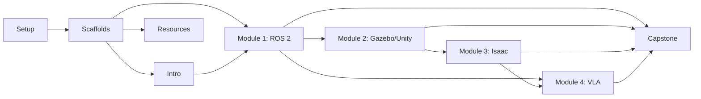

# Tasks: Physical AI & Humanoid Robotics Book

**Input**: Design documents from `/specs/001-docusaurus-book-spec/`
**Prerequisites**: spec.md (user stories P1-P4), constitution.md (book principles)

**Organization**: Tasks grouped by phase. Each module broken into 15-60 min tasks.
Content tasks tagged by user story: US1=Navigation/Theory, US2=Code Examples, US3=Exercises/Troubleshooting, US4=Instructor Support.

## Format: `[ID] [P?] [Story] Description`

- **[P]**: Can run in parallel (different files, no dependencies)
- **[Story]**: US1-US4 maps to spec.md user stories

---

## Phase 1: Setup (Docusaurus Project Initialization)

**Purpose**: Initialize Docusaurus v3 project with TypeScript, Mermaid, and GitHub Pages deployment

- [x] T001 Initialize Docusaurus v3 project with TypeScript in /docs/ via `npx create-docusaurus@latest docs classic --typescript`
- [x] T002 Install Mermaid theme plugin via `npm install @docusaurus/theme-mermaid` in /docs/
- [x] T003 Configure docusaurus.config.ts with site metadata, Mermaid support, and GitHub Pages settings in docs/docusaurus.config.ts
  - → Enable `markdown.mermaid: true`
  - → Add `@docusaurus/theme-mermaid` to themes array
  - → Set `url`, `baseUrl`, `organizationName`, `projectName` for GitHub Pages
  - → Configure Prism languages: python, bash, yaml, xml, cpp
- [x] T004 Configure sidebar with exact 8-page order in docs/sidebars.ts
  - → index, intro, module1-ros2, module2-gazebo-unity, module3-isaac, module4-vla, capstone, resources
- [x] T005 [P] Create GitHub Actions deployment workflow in .github/workflows/deploy.yml
  - → Node 20, npm ci, build, deploy to GitHub Pages
- [x] T006 [P] Add custom CSS for book styling (admonition colors, code block themes) in docs/src/css/custom.css

**Checkpoint**: `npm start` runs locally, sidebar shows 8 placeholder pages, Mermaid renders.

---

## Phase 2: Foundational (Page Scaffolds with Front Matter)

**Purpose**: Create all 8 .mdx files with correct front matter and empty section headings (FR-001, FR-017, FR-018)

- [x] T007 [P] Create docs/docs/index.mdx with front matter (id: index, title, sidebar_position: 1) and placeholder hero section
- [x] T008 [P] Create docs/docs/intro.mdx with front matter (id: intro, sidebar_position: 2) and section headings
- [x] T009 [P] Create docs/docs/module1-ros2.mdx with front matter (id: module1-ros2, sidebar_position: 3) and 6 required section headings (Learning Objectives, Theory, Tutorials, Troubleshooting, Exercises, Documentation Links)
- [x] T010 [P] Create docs/docs/module2-gazebo-unity.mdx with front matter (id: module2-gazebo-unity, sidebar_position: 4) and 6 required section headings
- [x] T011 [P] Create docs/docs/module3-isaac.mdx with front matter (id: module3-isaac, sidebar_position: 5) and 6 required section headings
- [x] T012 [P] Create docs/docs/module4-vla.mdx with front matter (id: module4-vla, sidebar_position: 6) and 6 required section headings
- [x] T013 [P] Create docs/docs/capstone.mdx with front matter (id: capstone, sidebar_position: 7) and section headings
- [x] T014 [P] Create docs/docs/resources.mdx with front matter (id: resources, sidebar_position: 8) and 3 category headings (Official Documentation, Hardware Recommendations, Further Reading)

**Checkpoint**: All 8 pages accessible via sidebar in correct order. Each module page shows 6 empty section headings. Site deploys to GitHub Pages.

---

## Phase 3: Landing Page & Introduction (Priority: P1)

**Goal**: Students see course overview and understand what they will learn

### Landing Page (index.mdx)

- [x] T015 [US1] Write hero section with book title, subtitle, and call-to-action in docs/docs/index.mdx
- [x] T016 [US1] Write course overview section: target audience, prerequisites (Python, AI/ML, ROS), and 6-module structure outline in docs/docs/index.mdx (FR-002, SC-007)
- [x] T017 [US1] Add Mermaid diagram showing module dependency flow (Intro → M1 → M2 → M3 → M4 → Capstone) in docs/docs/index.mdx
- [x] T018 [US4] Add estimated total course completion time and per-module time estimates in docs/docs/index.mdx

### Introduction Page (intro.mdx)

- [x] T019 [US1] Write learning objectives bullet list for Introduction in docs/docs/intro.mdx (FR-005)
- [x] T020 [US1] Write theory: "What is Physical AI?" (~600 words) - define embodied intelligence, physical AI vs digital AI, the sim-to-real gap in docs/docs/intro.mdx (FR-006)
- [x] T021 [US1] Write theory: "Why Humanoid Robotics?" (~600 words) - motivation, applications, current state of the field in docs/docs/intro.mdx
- [x] T022 [US1] Write theory: "The Technology Stack" (~600 words) - overview of ROS 2, Gazebo, Isaac Sim, VLA models and how they connect in docs/docs/intro.mdx
- [x] T023 [US1] Add Mermaid diagram: Physical AI technology stack (sensors → perception → planning → action → actuators) in docs/docs/intro.mdx
- [x] T024 [US1] Add Mermaid diagram: Book learning path showing prerequisite flow between modules in docs/docs/intro.mdx
- [x] T025 [US1] Write "Prerequisites Checklist" section with self-assessment questions for Python, AI/ML, and ROS in docs/docs/intro.mdx
- [x] T026 [US1] Add :::note and :::tip admonitions for "How to Use This Book" guidance in docs/docs/intro.mdx

**Checkpoint**: Landing page communicates audience + prerequisites within 200 words (SC-007). Intro page provides compelling context for entire book.

---

## Phase 4: Module 1 - The Robotic Nervous System (ROS 2)

**Goal**: Students understand ROS 2 architecture and can write publisher/subscriber/service nodes

### Theory Content (US1)

- [x] T027 [US1] Write learning objectives for Module 1 in docs/docs/module1-ros2.mdx (FR-005)
  - → "Install and configure ROS 2 Humble workspace"
  - → "Implement publisher/subscriber communication patterns"
  - → "Create custom message types and services"
  - → "Launch multi-node systems with launch files"
  - → "Visualize robot state with RViz2"
- [x] T028 [US1] Write theory: "ROS 2 Architecture Overview" (~800 words) - DDS middleware, nodes, topics, services, actions in docs/docs/module1-ros2.mdx (FR-006)
- [x] T029 [US1] Write theory: "ROS 2 Communication Patterns" (~700 words) - pub/sub vs service/client vs action server, when to use each in docs/docs/module1-ros2.mdx
- [x] T030 [US1] Write theory: "ROS 2 Workspace and Build System" (~500 words) - colcon, packages, CMakeLists, setup.py in docs/docs/module1-ros2.mdx
- [x] T031 [US1] Add Mermaid diagram: ROS 2 node communication (publisher → topic → subscriber) in docs/docs/module1-ros2.mdx
- [x] T032 [US1] Add Mermaid diagram: ROS 2 computation graph showing nodes, topics, services for a robot system in docs/docs/module1-ros2.mdx
- [x] T033 [US1] Add Mermaid diagram: ROS 2 workspace directory structure in docs/docs/module1-ros2.mdx

### Tutorials with Code Examples (US1 + US2)

- [x] T034 [US2] Write Tutorial 1: "Setting Up Your ROS 2 Workspace" - numbered steps with bash code blocks for installing ROS 2 Humble, creating workspace, building with colcon in docs/docs/module1-ros2.mdx (FR-007, FR-008)
  - → Include all bash commands with `bash` language identifier
  - → Show expected terminal output after each step
- [x] T035 [US2] Write Tutorial 2: "Your First Publisher Node" - step-by-step Python code creating a node that publishes sensor data to a topic in docs/docs/module1-ros2.mdx
  - → Complete imports (rclpy, std_msgs)
  - → Comments explaining timer callbacks, QoS
  - → Expected `ros2 topic echo` output shown
- [x] T036 [US2] Write Tutorial 3: "Your First Subscriber Node" - step-by-step Python code receiving and processing messages in docs/docs/module1-ros2.mdx
  - → Complete imports, callback pattern explained
  - → Expected console output when publisher is running
- [x] T037 [US2] Write Tutorial 4: "Custom Messages and Services" - define .msg/.srv files, generate Python bindings, implement service server/client in docs/docs/module1-ros2.mdx
  - → Show CMakeLists.txt and package.xml changes
  - → Include both server and client code with output
- [x] T038 [US2] Write Tutorial 5: "Launch Files and Multi-Node Systems" - Python launch file starting multiple nodes with parameters in docs/docs/module1-ros2.mdx
  - → Show launch file with Node declarations
  - → Expected output showing all nodes running
- [x] T039 [US1] Add :::warning admonitions for common ROS 2 mistakes (sourcing setup.bash, domain ID conflicts, QoS mismatches) in docs/docs/module1-ros2.mdx
- [x] T040 [US1] Add :::tip admonitions for best practices (using ros2 CLI tools for debugging, colcon build --symlink-install) in docs/docs/module1-ros2.mdx

### Exercises & Troubleshooting (US3)

- [x] T041 [US3] Write "Common Errors & Troubleshooting" section with 5 entries in docs/docs/module1-ros2.mdx (FR-013, SC-005)
  - → "Package not found" after build (forgot to source)
  - → "No executable found" (setup.py entry_points misconfigured)
  - → "Topic not showing in ros2 topic list" (DDS domain ID mismatch)
  - → "QoS incompatibility" between publisher and subscriber
  - → "colcon build fails" (missing dependencies in package.xml)
- [x] T042 [US3] Write Exercise 1: "Build a Temperature Monitor" - create pub/sub system that publishes simulated sensor data and a subscriber that raises warnings in docs/docs/module1-ros2.mdx (FR-014)
  - → Clear requirements, expected output, success criteria
- [x] T043 [US3] Write Exercise 2: "Robot Command Service" - implement a service that accepts movement commands and returns execution status in docs/docs/module1-ros2.mdx
- [x] T044 [US3] Write Exercise 3: "Multi-Sensor Launch System" - create a launch file that starts 3+ simulated sensor nodes in docs/docs/module1-ros2.mdx

### Documentation Links (US4)

- [x] T045 [US4] Write "Official Documentation & Resources" section with links to ROS 2 Humble docs, ROS 2 tutorials, ROS Discourse, and ROS Answers in docs/docs/module1-ros2.mdx (FR-015)
- [x] T046 [US4] Add estimated completion time (6-8 hours) in module metadata in docs/docs/module1-ros2.mdx

**Checkpoint**: Module 1 complete. All 6 sections present in order (SC-003). Code examples run with ROS 2 Humble (SC-002). 5 troubleshooting entries (SC-005). 3 exercises completable with module knowledge (SC-008).

---

## Phase 5: Module 2 - The Digital Twin (Gazebo & Unity)

**Goal**: Students can create simulated environments and control robots in Gazebo and Unity

### Theory Content (US1)

- [x] T047 [US1] Write learning objectives for Module 2 in docs/docs/module2-gazebo-unity.mdx (FR-005)
- [x] T048 [US1] Write theory: "What is a Digital Twin?" (~700 words) - concept, benefits for robotics, sim-to-real transfer in docs/docs/module2-gazebo-unity.mdx
- [x] T049 [US1] Write theory: "Gazebo Simulation Fundamentals" (~800 words) - physics engines, SDF/URDF, plugins, sensors in docs/docs/module2-gazebo-unity.mdx
- [x] T050 [US1] Write theory: "Unity for Robotics Simulation" (~700 words) - Unity ML-Agents, perception, synthetic data in docs/docs/module2-gazebo-unity.mdx
- [x] T051 [US1] Write theory: "Gazebo vs Unity: When to Use Which" (~400 words) - comparison table, trade-offs in docs/docs/module2-gazebo-unity.mdx
- [x] T052 [US1] Add Mermaid diagram: Digital twin architecture (real robot ↔ simulation ↔ AI training loop) in docs/docs/module2-gazebo-unity.mdx
- [x] T053 [US1] Add Mermaid diagram: Gazebo plugin architecture (world, model, sensor, system plugins) in docs/docs/module2-gazebo-unity.mdx
- [x] T054 [US1] Add Mermaid diagram: Unity ML-Agents training pipeline in docs/docs/module2-gazebo-unity.mdx

### Tutorials with Code Examples (US1 + US2)

- [x] T055 [US2] Write Tutorial 1: "Installing Gazebo and ROS 2 Integration" - setup steps with bash commands in docs/docs/module2-gazebo-unity.mdx
- [x] T056 [US2] Write Tutorial 2: "Creating Your First URDF Robot Model" - step-by-step URDF/SDF with xml code blocks and expected Gazebo visualization in docs/docs/module2-gazebo-unity.mdx
- [x] T057 [US2] Write Tutorial 3: "Spawning and Controlling a Robot in Gazebo" - ROS 2 bridge, sending velocity commands via Python in docs/docs/module2-gazebo-unity.mdx
- [x] T058 [US2] Write Tutorial 4: "Adding Sensors to Your Simulated Robot" - camera, lidar, IMU plugins with ROS 2 topics in docs/docs/module2-gazebo-unity.mdx
- [x] T059 [US2] Write Tutorial 5: "Unity ML-Agents Quick Start" - setting up Unity project, creating a simple agent, connecting to Python training in docs/docs/module2-gazebo-unity.mdx
- [x] T060 [US1] Add :::warning admonitions for simulation pitfalls (physics timestep, mesh complexity, coordinate frames) in docs/docs/module2-gazebo-unity.mdx
- [x] T061 [US1] Add :::danger admonition for sim-to-real gap warnings in docs/docs/module2-gazebo-unity.mdx

### Exercises & Troubleshooting (US3)

- [x] T062 [US3] Write "Common Errors & Troubleshooting" section with 5 entries (URDF parsing errors, Gazebo crash on launch, missing textures, ROS bridge timeout, Unity build errors) in docs/docs/module2-gazebo-unity.mdx (FR-013)
- [x] T063 [US3] Write Exercise 1: "Build a Warehouse Robot World" - create Gazebo world with obstacles and a mobile robot in docs/docs/module2-gazebo-unity.mdx
- [x] T064 [US3] Write Exercise 2: "Sensor Fusion Dashboard" - combine camera + lidar data from simulated robot into RViz2 display in docs/docs/module2-gazebo-unity.mdx
- [x] T065 [US3] Write Exercise 3: "Unity Reach Task" - create a simple robotic arm reaching task in Unity ML-Agents in docs/docs/module2-gazebo-unity.mdx

### Documentation Links (US4)

- [x] T066 [US4] Write documentation links section with Gazebo docs, Unity ML-Agents docs, URDF tutorials, ROS 2 simulation docs in docs/docs/module2-gazebo-unity.mdx (FR-015)
- [x] T067 [US4] Add estimated completion time (8-10 hours) in docs/docs/module2-gazebo-unity.mdx

**Checkpoint**: Module 2 complete. All 6 sections in order. Gazebo tutorials run with ROS 2 Humble. 5 troubleshooting entries. 3 exercises.

---

## Phase 6: Module 3 - The AI-Robot Brain (NVIDIA Isaac)

**Goal**: Students understand NVIDIA Isaac Sim for advanced simulation, synthetic data generation, and reinforcement learning

### Theory Content (US1)

- [x] T068 [US1] Write learning objectives for Module 3 in docs/docs/module3-isaac.mdx (FR-005)
- [x] T069 [US1] Write theory: "NVIDIA Isaac Sim Overview" (~800 words) - Omniverse platform, USD format, physics simulation, ray tracing in docs/docs/module3-isaac.mdx
- [x] T070 [US1] Write theory: "Isaac Sim for Robot Learning" (~700 words) - domain randomization, synthetic data, RL training in simulation in docs/docs/module3-isaac.mdx
- [x] T071 [US1] Write theory: "Hardware Requirements & Alternatives" (~500 words) - GPU requirements, Docker setup, cloud options for students without RTX GPUs in docs/docs/module3-isaac.mdx
  - → :::warning admonition: "Isaac Sim requires NVIDIA RTX 2070+ GPU with 8GB+ VRAM"
  - → :::tip admonition: "Use Docker container or NVIDIA NGC cloud for lighter setup"
- [x] T072 [US1] Add Mermaid diagram: Isaac Sim architecture (Omniverse Kit → Physics → Rendering → ROS 2 Bridge) in docs/docs/module3-isaac.mdx
- [x] T073 [US1] Add Mermaid diagram: Synthetic data pipeline (scene → domain randomization → render → labeled dataset) in docs/docs/module3-isaac.mdx
- [x] T074 [US1] Add Mermaid diagram: RL training loop (Isaac Gym → policy → sim evaluation → reward → update) in docs/docs/module3-isaac.mdx

### Tutorials with Code Examples (US1 + US2)

- [x] T075 [US2] Write Tutorial 1: "Installing Isaac Sim via Docker" - step-by-step Docker pull and run commands with expected output in docs/docs/module3-isaac.mdx
- [x] T076 [US2] Write Tutorial 2: "Loading a Robot in Isaac Sim" - Python scripting API to load URDF, position robot, start simulation in docs/docs/module3-isaac.mdx
- [x] T077 [US2] Write Tutorial 3: "Connecting Isaac Sim to ROS 2" - enable ROS 2 bridge, publish/subscribe between Isaac and ROS 2 nodes in docs/docs/module3-isaac.mdx
- [x] T078 [US2] Write Tutorial 4: "Generating Synthetic Training Data" - set up camera, domain randomization, export labeled images in docs/docs/module3-isaac.mdx
- [x] T079 [US2] Write Tutorial 5: "Reinforcement Learning with Isaac Gym" - train a simple locomotion policy using Isaac Gym RL framework in docs/docs/module3-isaac.mdx
- [x] T080 [US1] Add :::note admonition about Isaac Sim licensing (free for individuals, educational use) in docs/docs/module3-isaac.mdx
- [x] T081 [US1] Add :::caution admonitions for GPU memory and performance considerations in docs/docs/module3-isaac.mdx

### Exercises & Troubleshooting (US3)

- [x] T082 [US3] Write "Common Errors & Troubleshooting" section with 5 entries (CUDA driver mismatch, Docker GPU passthrough, Isaac Sim crash on start, ROS 2 bridge no connection, USD file loading errors) in docs/docs/module3-isaac.mdx (FR-013)
- [x] T083 [US3] Write Exercise 1: "Custom Environment Setup" - create Isaac Sim scene with table, objects, and a manipulator robot in docs/docs/module3-isaac.mdx
- [x] T084 [US3] Write Exercise 2: "Synthetic Dataset Generator" - generate 100 labeled images using domain randomization in docs/docs/module3-isaac.mdx
- [x] T085 [US3] Write Exercise 3: "RL-Trained Walker" - train a simple bipedal locomotion policy using Isaac Gym in docs/docs/module3-isaac.mdx

### Documentation Links (US4)

- [x] T086 [US4] Write documentation links section with Isaac Sim docs, Omniverse docs, Isaac Gym docs, NVIDIA NGC in docs/docs/module3-isaac.mdx (FR-015)
- [x] T087 [US4] Add estimated completion time (8-10 hours) and hardware requirements matrix in docs/docs/module3-isaac.mdx

**Checkpoint**: Module 3 complete. Tutorials include Docker-based setup path. Hardware warnings prominent. 5 troubleshooting entries. 3 exercises (1 possible without GPU).

---

## Phase 7: Module 4 - Vision-Language-Action (VLA)

**Goal**: Students understand VLA models and can deploy an open-source VLA model with ROS 2

### Theory Content (US1)

- [x] T088 [US1] Write learning objectives for Module 4 in docs/docs/module4-vla.mdx (FR-005)
- [x] T089 [US1] Write theory: "From Language Models to Robot Actions" (~800 words) - evolution from LLMs → VLMs → VLAs, key papers (RT-1, RT-2, PaLM-E) in docs/docs/module4-vla.mdx
- [x] T090 [US1] Write theory: "VLA Architecture Explained" (~700 words) - vision encoder, language encoder, action decoder, tokenization of actions in docs/docs/module4-vla.mdx
- [x] T091 [US1] Write theory: "Open-Source VLA Models" (~600 words) - Octo, OpenVLA comparison, hardware requirements, quantization options for students in docs/docs/module4-vla.mdx
- [x] T092 [US1] Add Mermaid diagram: VLA model architecture (Image + Language instruction → Transformer → Action tokens → Robot commands) in docs/docs/module4-vla.mdx
- [x] T093 [US1] Add Mermaid diagram: VLA training pipeline (dataset → pretraining → fine-tuning → deployment) in docs/docs/module4-vla.mdx
- [x] T094 [US1] Add Mermaid diagram: ROS 2 ↔ VLA integration pattern (camera topic → VLA node → action topic → robot controller) in docs/docs/module4-vla.mdx

### Tutorials with Code Examples (US1 + US2)

- [x] T095 [US2] Write Tutorial 1: "Setting Up a VLA Environment" - install PyTorch, HuggingFace Transformers, download Octo model checkpoints in docs/docs/module4-vla.mdx
- [x] T096 [US2] Write Tutorial 2: "Running Inference with Octo" - load pretrained model, prepare observation, get action prediction with Python in docs/docs/module4-vla.mdx
  - → Complete imports (torch, transformers, octo)
  - → Show model loading, observation preprocessing
  - → Expected output (action vector with explanation)
- [x] T097 [US2] Write Tutorial 3: "Building a ROS 2 VLA Bridge Node" - create rclpy node that subscribes to camera topic, runs VLA inference, publishes action commands in docs/docs/module4-vla.mdx
  - → Full ROS 2 node with image callback, model inference, action publishing
  - → cv_bridge usage for image conversion
- [x] T098 [US2] Write Tutorial 4: "Fine-Tuning a VLA Model on Custom Data" - prepare dataset, configure training, run fine-tuning loop in docs/docs/module4-vla.mdx
- [x] T099 [US2] Write Tutorial 5: "Evaluating VLA Performance in Simulation" - connect VLA to Isaac Sim/Gazebo, measure success rate on pick-and-place task in docs/docs/module4-vla.mdx
- [x] T100 [US1] Add :::warning about GPU memory requirements (Octo: 8-12 GB, OpenVLA: 16-24 GB) with quantization alternatives in docs/docs/module4-vla.mdx
- [x] T101 [US1] Add :::tip about using Google Colab Pro for VLA experiments without local GPU in docs/docs/module4-vla.mdx

### Exercises & Troubleshooting (US3)

- [x] T102 [US3] Write "Common Errors & Troubleshooting" section with 5 entries (CUDA OOM, model checkpoint download failure, tokenizer mismatch, cv_bridge import error, action space mismatch) in docs/docs/module4-vla.mdx (FR-013)
- [x] T103 [US3] Write Exercise 1: "VLA Inference Benchmark" - measure latency and accuracy of Octo on standard manipulation tasks in docs/docs/module4-vla.mdx
- [x] T104 [US3] Write Exercise 2: "Custom ROS 2 VLA Pipeline" - build end-to-end pipeline from camera to robot action using ROS 2 in docs/docs/module4-vla.mdx
- [x] T105 [US3] Write Exercise 3: "Compare VLA vs Classical Planning" - implement same task with VLA and with MoveIt, compare results in docs/docs/module4-vla.mdx

### Documentation Links (US4)

- [x] T106 [US4] Write documentation links section with Octo repo, OpenVLA repo, RT-2 paper, HuggingFace model cards, key research papers list in docs/docs/module4-vla.mdx (FR-015)
- [x] T107 [US4] Add estimated completion time (8-10 hours) and GPU requirements table in docs/docs/module4-vla.mdx

**Checkpoint**: Module 4 complete. VLA concepts taught with accessible open-source models. ROS 2 integration demonstrated. 5 troubleshooting entries. 3 exercises.

---

## Phase 8: Capstone Project - The Autonomous Humanoid

**Goal**: Students integrate all modules into a complete autonomous humanoid system

### Content (US1 + US2 + US3)

- [x] T108 [US1] Write learning objectives for Capstone in docs/docs/capstone.mdx (FR-005)
- [x] T109 [US1] Write project overview (~800 words): integrate ROS 2 + Gazebo/Isaac + VLA into autonomous humanoid that receives natural language commands and executes physical tasks in docs/docs/capstone.mdx
- [x] T110 [US1] Add Mermaid diagram: Complete system architecture showing all modules integrated (ROS 2 nodes → Gazebo sim → Isaac training → VLA inference → robot control) in docs/docs/capstone.mdx
- [x] T111 [US1] Add Mermaid diagram: Capstone project milestone timeline (4-6 week schedule) in docs/docs/capstone.mdx
- [x] T112 [US2] Write Capstone Step 1: "Setting Up the Humanoid Robot Model" - URDF/SDF for humanoid, spawning in Gazebo and Isaac Sim with code in docs/docs/capstone.mdx
- [x] T113 [US2] Write Capstone Step 2: "Building the ROS 2 Control Architecture" - node graph with perception, planning, and control nodes with code in docs/docs/capstone.mdx
- [x] T114 [US2] Write Capstone Step 3: "Training the VLA Policy" - fine-tune Octo/OpenVLA on humanoid manipulation tasks with code in docs/docs/capstone.mdx
- [x] T115 [US2] Write Capstone Step 4: "Integrating Language Commands" - natural language → VLA → robot action pipeline with code in docs/docs/capstone.mdx
- [x] T116 [US2] Write Capstone Step 5: "Testing and Evaluation" - define success metrics, run evaluation in simulation, record results with code in docs/docs/capstone.mdx
- [x] T117 [US3] Write "Capstone Troubleshooting" section with 3-5 common integration errors in docs/docs/capstone.mdx
- [x] T118 [US1] Add :::tip admonitions for project scope management and milestone suggestions in docs/docs/capstone.mdx
- [x] T119 [US4] Add estimated completion time (20-30 hours) and grading rubric suggestions in docs/docs/capstone.mdx

**Checkpoint**: Capstone provides clear path from individual modules to integrated system. Milestones are realistic. All code builds on prior modules.

---

## Phase 9: Resources Page

**Goal**: Comprehensive reference page for students and instructors

- [x] T120 [P] [US1] Write "Official Documentation" section with categorized links (ROS 2, Gazebo, Unity, Isaac Sim, PyTorch, HuggingFace) in docs/docs/resources.mdx (FR-003)
- [x] T121 [P] [US1] Write "Hardware Recommendations" section with GPU tiers (budget/mid/high), robot platforms (TurtleBot, Unitree), sensors in docs/docs/resources.mdx (FR-003)
- [x] T122 [P] [US1] Write "Further Reading" section with key research papers, textbooks, online courses, and community links in docs/docs/resources.mdx (FR-003)
- [x] T123 [US1] Add "Environment Setup Cheat Sheet" with version compatibility matrix (ROS 2 Humble + Gazebo + Isaac + Python) in docs/docs/resources.mdx

**Checkpoint**: Resources page has 3 categorized sections (SC-003). All links functional.

---

## Phase 10: Polish & Cross-Cutting Concerns

**Purpose**: Quality validation across all pages

- [x] T124 Verify all 8 pages display sections in required order via visual inspection (SC-003)
- [x] T125 Word count audit: verify all theory sections are 800 words or fewer per subtopic (SC-004)
- [x] T126 Verify all code blocks have correct language identifiers (python, bash, yaml, xml, typescript) (SC-006)
- [x] T127 Verify all Mermaid diagrams render correctly and include descriptive captions (SC-010)
- [x] T128 Add alt text descriptions to all Mermaid diagrams for accessibility (SC-010)
- [x] T129 Cross-reference check: verify all inter-module links work (e.g., Module 4 references Module 1 concepts)
- [x] T130 Verify landing page states target audience and prerequisites within first 200 words (SC-007)
- [x] T131 Run `npm run build` to validate all MDX compiles without errors
- [x] T132 Deploy to GitHub Pages and verify all pages accessible (SC-009)

---

## Dependencies & Execution Order

### Phase Dependencies

- **Phase 1 (Setup)**: No dependencies - start immediately
- **Phase 2 (Scaffolds)**: Depends on Phase 1 completion
- **Phase 3 (Landing + Intro)**: Depends on Phase 2 - start here for MVP
- **Phases 4-7 (Modules 1-4)**: Depend on Phase 2. Can run in parallel with each other.
- **Phase 8 (Capstone)**: Depends on Phases 4-7 (references all modules)
- **Phase 9 (Resources)**: Can run in parallel with Phases 4-8
- **Phase 10 (Polish)**: Depends on all content phases complete

### Module Writing Order (Recommended Sequential)

```
Phase 1 → Phase 2 → Phase 3 → Phase 4 → Phase 5 → Phase 6 → Phase 7 → Phase 8 → Phase 9 → Phase 10
Setup     Scaffold   Intro      M1:ROS2    M2:Gazebo  M3:Isaac   M4:VLA     Capstone   Resources  Polish
```

### Module Dependencies



### Parallel Opportunities

Within each module phase, these task types can run in parallel:
- Theory sections [P] (different h2 subtopics)
- Diagrams [P] (independent Mermaid blocks)
- Exercises [P] (independent of each other)

Across modules (if multiple writers):
- Module 1 and Resources can run in parallel
- Module 2 starts after Module 1 theory (needs ROS 2 concepts)
- Module 3 starts after Module 2 (builds on simulation concepts)
- Module 4 can start after Module 1 (needs ROS 2 bridge pattern)

---

## Implementation Strategy

### MVP First (Phases 1-4 Only)

1. Complete Phase 1: Docusaurus Setup
2. Complete Phase 2: Page Scaffolds
3. Complete Phase 3: Landing Page + Introduction
4. Complete Phase 4: Module 1 (ROS 2)
5. **STOP and VALIDATE**: Deploy, verify navigation (SC-001), code examples (SC-002), section order (SC-003)
6. Deploy to GitHub Pages as early preview

### Incremental Delivery

1. Setup + Scaffolds + Intro + Module 1 → **Deploy v0.1** (MVP)
2. Add Module 2 (Gazebo/Unity) → **Deploy v0.2**
3. Add Module 3 (Isaac) → **Deploy v0.3**
4. Add Module 4 (VLA) → **Deploy v0.4**
5. Add Capstone + Resources + Polish → **Deploy v1.0**

---

## Summary

| Phase | Tasks | Est. Time | Key Files |
|-------|-------|-----------|-----------|
| 1. Setup | T001-T006 | 2-3 hrs | docusaurus.config.ts, sidebars.ts, deploy.yml |
| 2. Scaffolds | T007-T014 | 1-2 hrs | All 8 .mdx files (stubs) |
| 3. Intro | T015-T026 | 3-4 hrs | index.mdx, intro.mdx |
| 4. Module 1 (ROS 2) | T027-T046 | 8-10 hrs | module1-ros2.mdx |
| 5. Module 2 (Gazebo) | T047-T067 | 8-10 hrs | module2-gazebo-unity.mdx |
| 6. Module 3 (Isaac) | T068-T087 | 8-10 hrs | module3-isaac.mdx |
| 7. Module 4 (VLA) | T088-T107 | 8-10 hrs | module4-vla.mdx |
| 8. Capstone | T108-T119 | 6-8 hrs | capstone.mdx |
| 9. Resources | T120-T123 | 2-3 hrs | resources.mdx |
| 10. Polish | T124-T132 | 3-4 hrs | All files |
| **Total** | **132 tasks** | **~50-64 hrs** | **8 content files + config** |

## Notes

- [P] tasks = different files or independent sections, no dependencies
- [US1-US4] maps tasks to spec.md user stories for traceability
- Each module follows same internal structure: objectives → theory → tutorials → troubleshooting → exercises → links
- All code examples target ROS 2 Humble + Python 3.10+
- Commit after completing each phase or major task group
- Stop at any checkpoint to validate and deploy incremental progress
